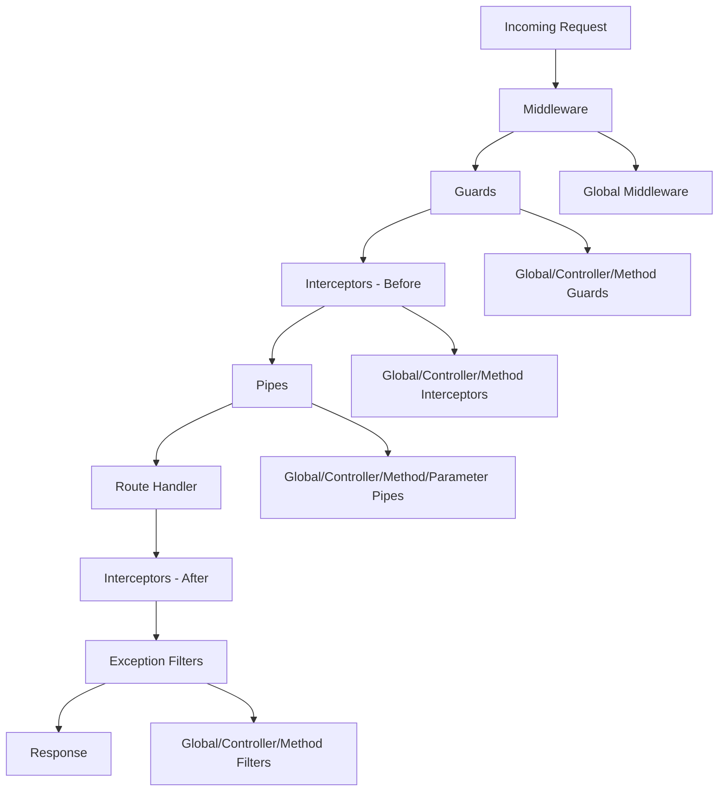
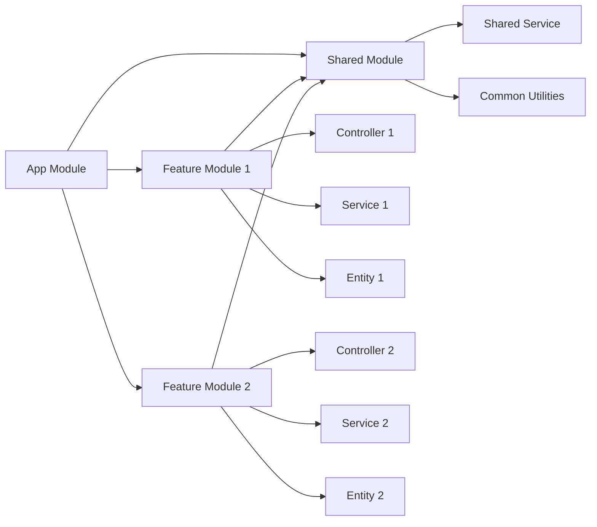

# NestJS Fast Revision Cheat Sheet

## 📑 Table of Contents

### 📚 [Overview](#overview)
- [First Steps](#first-steps)
- [Controllers](#controllers)
- [Providers](#providers)
- [Modules](#modules)
- [Middleware](#middleware)
- [Exception Filters](#exception-filters)
- [Pipes](#pipes)
- [Guards](#guards)
- [Interceptors](#interceptors)
- [Custom Decorators](#custom-decorators)

### 🏗️ [Fundamentals](#fundamentals)
- [Custom Providers](#custom-providers)
- [Asynchronous Providers](#asynchronous-providers)
- [Dynamic Modules](#dynamic-modules)
- [Injection Scopes](#injection-scopes)
- [Circular Dependency](#circular-dependency)
- [Module Reference](#module-reference)
- [Lazy-loading Modules](#lazy-loading-modules)
- [Execution Context](#execution-context)
- [Lifecycle Events](#lifecycle-events)
- [Discovery Service](#discovery-service)
- [Platform Agnosticism](#platform-agnosticism)
- [Testing](#testing)

### 🛠️ [Techniques](#techniques)
- [Configuration](#configuration)
- [Database](#database)
- [Validation](#validation)
- [Caching](#caching)
- [Serialization](#serialization)
- [Versioning](#versioning)
- [Event](#event)
- [Compression](#compression)
- [HTTP Module](#http-module)

### 🔒 [Security](#security)
- [Authentication](#authentication)
- [Authorization](#authorization)
- [Encryption and Hashing](#encryption-and-hashing)
- [Helmet](#helmet)
- [CORS](#cors)
- [CSRF Protection](#csrf-protection)
- [Rate Limiting](#rate-limiting)

### 📊 [Visual Diagrams](#visual-diagrams)
- [Request Lifecycle Flow](#request-lifecycle-flow)
- [Module Architecture](#module-architecture)

---

## 📚 Overview

### First Steps

NestJS is a progressive Node.js framework built with TypeScript that combines elements of OOP, FP, and FRP.

**Installation & Setup:**
```bash
npm i -g @nestjs/cli
nest new project-name
cd project-name
npm run start:dev
```

**Basic Project Structure:**
```
src/
├── app.controller.ts
├── app.module.ts
├── app.service.ts
└── main.ts
```

### Controllers

Controllers handle incoming HTTP requests and return responses to the client.

**Purpose:** Route handling, request/response management

**Key Features:** Decorators for HTTP methods, parameter extraction, status codes

```typescript
import { Controller, Get, Post, Body, Param } from '@nestjs/common';

@Controller('cats')
export class CatsController {
  @Get()
  findAll(): string {
    return 'This action returns all cats';
  }

  @Get(':id')
  findOne(@Param('id') id: string): string {
    return `This action returns cat #${id}`;
  }

  @Post()
  create(@Body() createCatDto: any): string {
    return 'This action adds a new cat';
  }
}
```

**Common Decorators:**
- `@Get()`, `@Post()`, `@Put()`, `@Delete()`
- `@Param()`, `@Body()`, `@Query()`, `@Headers()`

### Providers

Providers are injectable classes that handle business logic and can be injected as dependencies.

**Purpose:** Business logic, data access, shared functionality

**Key Features:** Dependency injection, singleton pattern, custom providers

```typescript
import { Injectable } from '@nestjs/common';

@Injectable()
export class CatsService {
  private readonly cats: Cat[] = [];

  create(cat: Cat) {
    this.cats.push(cat);
  }

  findAll(): Cat[] {
    return this.cats;
  }
}

// Injection in controller
@Controller('cats')
export class CatsController {
  constructor(private catsService: CatsService) {}

  @Post()
  async create(@Body() createCatDto: CreateCatDto) {
    this.catsService.create(createCatDto);
  }
}
```

### Modules

Modules organize and encapsulate related functionality using the `@Module()` decorator.

**Purpose:** Code organization, dependency management, feature encapsulation

**Key Features:** Providers, controllers, imports, exports

```typescript
import { Module } from '@nestjs/common';
import { CatsController } from './cats.controller';
import { CatsService } from './cats.service';

@Module({
  controllers: [CatsController],
  providers: [CatsService],
  exports: [CatsService], // Make available to other modules
})
export class CatsModule {}

// App Module
@Module({
  imports: [CatsModule],
  controllers: [AppController],
  providers: [AppService],
})
export class AppModule {}
```

### Middleware

Middleware functions execute during the request-response cycle, before route handlers.

**Purpose:** Request preprocessing, logging, authentication

**Key Features:** Access to request/response objects, next function

```typescript
import { Injectable, NestMiddleware } from '@nestjs/common';
import { Request, Response, NextFunction } from 'express';

@Injectable()
export class LoggerMiddleware implements NestMiddleware {
  use(req: Request, res: Response, next: NextFunction) {
    console.log(`${req.method} ${req.originalUrl}`);
    next();
  }
}

// Apply middleware
export class AppModule implements NestModule {
  configure(consumer: MiddlewareConsumer) {
    consumer
      .apply(LoggerMiddleware)
      .forRoutes('cats');
  }
}
```

### Exception Filters

Exception filters handle unhandled exceptions and provide consistent error responses.

**Purpose:** Error handling, custom error responses

**Key Features:** Global/local scope, custom exception classes

```typescript
import { ExceptionFilter, Catch, ArgumentsHost, HttpException } from '@nestjs/common';

@Catch(HttpException)
export class HttpExceptionFilter implements ExceptionFilter {
  catch(exception: HttpException, host: ArgumentsHost) {
    const ctx = host.switchToHttp();
    const response = ctx.getResponse();
    const request = ctx.getRequest();
    const status = exception.getStatus();

    response
      .status(status)
      .json({
        statusCode: status,
        timestamp: new Date().toISOString(),
        path: request.url,
        message: exception.message,
      });
  }
}

// Usage in cats.controller.ts
@Post()
@UseFilters(new HttpExceptionFilter())
async create(@Body() createCatDto: CreateCatDto) {
  throw new ForbiddenException();
}

// But if need to apply globally
// main.ts
import { NestFactory } from '@nestjs/core';
import { AppModule } from './app.module';
import { HttpExceptionFilter } from './http-exception.filter';

async function bootstrap() {
  const app = await NestFactory.create(AppModule);
  app.useGlobalFilters(new HttpExceptionFilter()); // applied everywhere
  await app.listen(3000);
}
bootstrap();
```

**Note:** 
We can apply filter to catch both HTTP exceptions (e.g., NotFoundException, BadRequestException...) and unexpected runtime errors (like TypeError, DB errors, etc.).
- `@Catch()` : no parameter = catch ALL exceptions
- `@Catch(HttpException)` :  catch  HTTP exceptions


### Pipes

Pipes are classes that transform or validate incoming data before it reaches the route handler. They ensure data integrity and reduce boilerplate in controllers.

**Purpose:** Data validation, data transformation

**Key Features:** 
- built-in pipes like ValidationPipe, ParseIntPipe, ParseUUIDPipe
- You can write custom pipes to fit your logic.
- Async Pipe : Validate against external services or databases (e.g., check if ID exists)
- Pipes can be applied: Per-parameter , Per-route , Globally

**Example 1 - Simple Custom Validation Pipe**

```typescript
import { PipeTransform, Injectable, ArgumentMetadata, BadRequestException } from '@nestjs/common';

@Injectable()
export class CustomValidationPipe implements PipeTransform {
  transform(value: any, metadata: ArgumentMetadata) {
    if (value === null || value === undefined || value === '') {
      throw new BadRequestException(`Validation failed for ${metadata.data}`);
    }
    return value;
  }
}

// Usage per parameter
@Get(':id')
findOne(@Param('id', CustomValidationPipe) id: string) {
  return `Cat with id ${id}`;
}
```

**Example 2 - Using class-validator & class-transformer (Recommended)**

Install dependencies
```bash
npm install class-validator class-transformer
```

DTO with Validation Rules
```typescript
import { IsString, IsInt, MinLength, Min } from 'class-validator';

export class CreateCatDto {
  @IsString()
  @MinLength(3)
  name: string;

  @IsInt()
  @Min(1)
  age: number;
}

// Usage in Controller
import { Body, Controller, Post, UsePipes, ValidationPipe } from '@nestjs/common';

@Controller('cats')
export class CatsController {
  @Post()
  @UsePipes(new ValidationPipe({ transform: true })) // transform: true automatically converts types (e.g., "5" → 5).
  async create(@Body() createCatDto: CreateCatDto) {
    return { message: 'Cat created', data: createCatDto };
  }
}

// Note: Validation rules are applied from class-validator
```

**Example 3 – Async Pipe (check DB existence)**
```typescript
import { Injectable, PipeTransform, BadRequestException } from '@nestjs/common';
import { CatsService } from './cats.service';

@Injectable()
export class CatExistsPipe implements PipeTransform {
  constructor(private readonly catsService: CatsService) {}

  async transform(id: string) {
    const cat = await this.catsService.findOne(id);
    if (!cat) {
      throw new BadRequestException(`Cat with ID ${id} does not exist`);
    }
    return id;
  }
}

// Usage
@Get(':id')
async findOne(@Param('id', CatExistsPipe) id: string) {
  return this.catsService.findOne(id);
}
```

**Example 3 – Using Zod-based schemas**

Recommend for Medium-to-large TypeScript-heavy project with GraphQL/tRPC or many complex/nested DTOs: consider Zod, especially for type inference and transformations

Install Zod
```bash
npm install zod
```

Define Schema
```typescript
import { z } from 'zod';

export const CreateCatSchema = z.object({
  name: z.string().min(2),
  age: z.number().int().min(1),
});
```

Validate in Controller
```typescript
import { Controller, Post, Body, BadRequestException } from '@nestjs/common';
import { CreateCatSchema } from './create-cat.schema';

@Controller('cats')
export class CatsController {
  @Post()
  create(@Body() body: any) {
    const parseResult = CreateCatSchema.safeParse(body);

    if (!parseResult.success) {
      // validation failed
      throw new BadRequestException(parseResult.error.format());
    }

    // validation passed
    return { message: 'Cat created', cat: parseResult.data };
  }
}
```

**Note:** When Enable Global ValidationPipe is applied:"
- No need to use `@UsePipes()` in every controller
- Automatically strips unknown fields
- Automatic type conversion

    **Example - Enable Global ValidationPipe**
    ```typescript
    // main.ts
    import { NestFactory } from '@nestjs/core';
    import { AppModule } from './app.module';
    import { ValidationPipe } from '@nestjs/common';
    
    async function bootstrap() {
      const app = await NestFactory.create(AppModule);
    
      // Apply ValidationPipe globally
      app.useGlobalPipes(
        new ValidationPipe({
          whitelist: true,                // remove properties not in DTO
          forbidNonWhitelisted: true,     // throw error if extra properties are sent
          transform: true,                // automatically transform types
          transformOptions: { enableImplicitConversion: true }, // e.g., "5" -> 5
        }),
      );
    
      await app.listen(3000);
    }
    bootstrap();
    ```

### Guards

- A Guard decides if a request is allowed to proceed to the controller/route handler.
- They run befnore controllers and are often used for authentication and authorization.
- If the guard returns true → request continues.
- If it returns false → NestJS throws a 403 Forbidden by default.
  
**Purpose:** Authentication, authorization, access control

**Key Features:** CanActivate interface, ExecutionContext access

**Example 1 - Basic Auth Guard (Check Authorization Header)**
```typescript
// auth.guard.ts
import { Injectable, CanActivate, ExecutionContext, UnauthorizedException } from '@nestjs/common';

@Injectable()
export class AuthGuard implements CanActivate {
  canActivate(context: ExecutionContext): boolean {
    const request = context.switchToHttp().getRequest();

    const authHeader = request.headers.authorization;

    if (!authHeader) {
      throw new UnauthorizedException('Missing authorization header');
    }

    // Example: token must start with "Bearer"
    if (!authHeader.startsWith('Bearer ')) {
      throw new UnauthorizedException('Invalid token format');
    }

    // Normally you would validate the token here (e.g., JWT check)
    const token = authHeader.split(' ')[1];
    if (token !== 'my-secret-token') {
      throw new UnauthorizedException('Invalid token');
    }

    return true; // allow request
  }
}

// Apply to Controller/Route
// cats.controller.ts
import { Controller, Get, UseGuards } from '@nestjs/common';
import { AuthGuard } from './auth.guard';

@Controller('cats')
export class CatsController {
  @Get()
  @UseGuards(AuthGuard) // Protect this route
  findAll() {
    return [{ name: 'Tom', age: 3 }];
  }
}

```

**Example 2 - Role-Based Guard**
Sometimes we want not just authentication, but authorization (e.g., admin vs. user).

```typescript
// roles.guard.ts
import { Injectable, CanActivate, ExecutionContext, ForbiddenException } from '@nestjs/common';
import { Reflector } from '@nestjs/core';

@Injectable()
export class RolesGuard implements CanActivate {
  constructor(private reflector: Reflector) {}

  canActivate(context: ExecutionContext): boolean {
    const requiredRoles = this.reflector.get<string[]>('roles', context.getHandler());
    if (!requiredRoles) {
      return true; // no roles required
    }

    const request = context.switchToHttp().getRequest();
    const user = request.user; // e.g., set by AuthGuard

    if (!user || !requiredRoles.includes(user.role)) {
      throw new ForbiddenException('You do not have permission for this resource');
    }

    return true;
  }
}
```

Use with a Custom Decorator
```typescript
// roles.decorator.ts
import { SetMetadata } from '@nestjs/common';
export const Roles = (...roles: string[]) => SetMetadata('roles', roles);
```

**Example 3 - Apply both guards**
```typescript
import { Controller, Get, UseGuards } from '@nestjs/common';
import { Roles } from './roles.decorator';
import { RolesGuard } from './roles.guard';
import { AuthGuard } from './auth.guard';

@Controller('admin')
@UseGuards(AuthGuard, RolesGuard) // Apply both guards
export class AdminController {
  @Get()
  @Roles('admin') // Only admin can access
  findAdminData() {
    return { secret: 'Top secret admin stuff' };
  }
}
```

### Interceptors

An Interceptor in NestJS is like middleware that sits around your route handler (controller method).

**Purpose:** Response transformation, logging, caching, timeout handling

**Key Features:** 
- Transform the request before it reaches the handler.
- Transform the response before it is sent back.
- Handle extra logic like logging, caching, performance monitoring.
- Bind extra behavior (e.g., add metadata, wrap responses).

**Example 1 - Logging Interceptor**

Logs how long each request takes.
```typescript
// logging.interceptor.ts
import { Injectable, NestInterceptor, ExecutionContext, CallHandler, Logger } from '@nestjs/common';
import { Observable, tap } from 'rxjs';

@Injectable()
export class LoggingInterceptor implements NestInterceptor {
  private readonly logger = new Logger(LoggingInterceptor.name);

  intercept(context: ExecutionContext, next: CallHandler): Observable<any> {
    const req = context.switchToHttp().getRequest();
    const { method, url } = req;
    const now = Date.now();

    this.logger.log(`➡️  ${method} ${url} request started`);

    return next.handle().pipe( 
      tap(() => this.logger.log(`⬅️  ${method} ${url} finished in ${Date.now() - now}ms`)),
    );
     // next.handle() → executes the controller method , .pipe(tap(...)) → logs after the response has been produced.
  }
}
```
  - **Usage 1 - Apply a Logging in each controller**
  ```typescript
  import { Controller, Get, UseInterceptors } from '@nestjs/common';
  import { LoggingInterceptor } from './logging.interceptor';
  
  @Controller('cats')
  @UseInterceptors(LoggingInterceptor) // applies to all routes in this controller
  export class CatsController {
    @Get()
    findAll() {
      return [{ name: 'Tom', age: 3 }];
    }
  }
  ```

 - **Usage 2 - Apply a Logging Interceptor Globally**
  ```typescript
  // main.ts
  import { NestFactory } from '@nestjs/core';
  import { AppModule } from './app.module';
  import { LoggingInterceptor } from './common/interceptors/logging.interceptor';
  
  async function bootstrap() {
    const app = await NestFactory.create(AppModule);
  
    app.useGlobalInterceptors(new LoggingInterceptor()); // 🌍 global interceptor
  
    await app.listen(3000);
  }
  bootstrap();
  ```

**Example 2 - Response Transformation Interceptor**

Wraps every response in a consistent format.
```typescript
// transform.interceptor.ts
import { Injectable, NestInterceptor, ExecutionContext, CallHandler } from '@nestjs/common';
import { Observable, map } from 'rxjs';

@Injectable()
export class TransformInterceptor<T> implements NestInterceptor<T, { data: T }> {
  intercept(context: ExecutionContext, next: CallHandler): Observable<any> {
    return next.handle().pipe(  
      map(data => ({
        success: true,
        timestamp: new Date().toISOString(),
        data,
      })),
    );
  }
}

// Usage
import { Controller, Get, UseInterceptors } from '@nestjs/common';
import { TransformInterceptor } from './transform.interceptor';

@Controller('dogs')
@UseInterceptors(TransformInterceptor)
export class DogsController {
  @Get()
  findAll() {
    return [{ name: 'Spike', breed: 'Bulldog' }];
  }
}
```
Response Example:
```json
{
  "success": true,
  "timestamp": "2025-09-21T07:00:00.000Z",
  "data": [
    { "name": "Spike", "breed": "Bulldog" }
  ]
}
```

**Example 3 - Error Handling Interceptor**

Catch and transform errors in a consistent format.
```typescript
// errors.interceptor.ts
import { Injectable, NestInterceptor, ExecutionContext, CallHandler, BadGatewayException } from '@nestjs/common';
import { Observable, catchError, throwError } from 'rxjs';

@Injectable()
export class ErrorsInterceptor implements NestInterceptor {
  intercept(context: ExecutionContext, next: CallHandler): Observable<any> {
    return next.handle().pipe(
      catchError(err =>
        throwError(() => new BadGatewayException('Something went wrong: ' + err.message)),
      ),
    );
  }
}
```

### Custom Decorators

Create reusable decorators for common functionality.
(They’re built using createParamDecorator or SetMetadata.)

**Purpose:** Code reusability, metadata extraction, parameter decoration, Encapsulate logic in one place

**Key Features:** Parameter decorators, method decorators, class decorators

**Example 1 - Custom Request Data Decorator**

Want to get the user from request in multiple controllers. Instead of doing:
```typescript
@Get()
getProfile(@Req() req) {
  return req.user;
}
```
Create a custom decorator:
```typescript
// user.decorator.ts
import { createParamDecorator, ExecutionContext } from '@nestjs/common';

export const User = createParamDecorator(
  (data: string | undefined, ctx: ExecutionContext) => {
    const request = ctx.switchToHttp().getRequest();
    const user = request.user;

    // If a specific property is requested -> return it
    return data ? user?.[data] : user;
  },
);

// Usage
@Get('profile')
getProfile(@User() user) {
  return user; // entire user object
}

@Get('profile/name')
getUserName(@User('name') name: string) {
  return name; // only the "name" property
}

// Benefit: No need to repeat req.user everywhere.
```

**Example 2 - Custom Role Metadata Decorator**

Want to restrict routes by roles (admin, user)
```typescript
// roles.decorator.ts
import { SetMetadata } from '@nestjs/common';

export const ROLES_KEY = 'roles';
export const Roles = (...roles: string[]) => SetMetadata(ROLES_KEY, roles);

// Usage in Controller
@Controller('cats')
export class CatsController {
  @Get()
  @Roles('admin') // add custom metadata
  findAll() {
    return 'Only admin can see this';
  }
}
```

Then use a Guard to read that metadata:
```typescript
import { CanActivate, ExecutionContext, Injectable, Reflector } from '@nestjs/common';

@Injectable()
export class RolesGuard implements CanActivate {
  constructor(private reflector: Reflector) {}

  canActivate(context: ExecutionContext): boolean {
    const roles = this.reflector.get<string[]>('roles', context.getHandler());
    if (!roles) return true;

    const request = context.switchToHttp().getRequest();
    const user = request.user;
    return roles.includes(user.role);
  }
}

// Benefit: Declarative role-based access control.
```

**Example 3 - Custom Header Extractor**

If you often need a custom header (e.g., x-api-key):
```typescript
// api-key.decorator.ts
import { createParamDecorator, ExecutionContext } from '@nestjs/common';

export const ApiKey = createParamDecorator(
  (data: unknown, ctx: ExecutionContext) => {
    const request = ctx.switchToHttp().getRequest();
    return request.headers['x-api-key'];
  },
);

// Usage
@Get('secure-data')
getSecureData(@ApiKey() apiKey: string) {
  return { apiKey };
}

// Benefit: Cleaner controller code, no repeating header logic.
```

**Example 4 - Custom Decorator with Pipe**

```typescript
// src/common/decorators/user-id.decorator.ts
import { createParamDecorator, ExecutionContext } from '@nestjs/common';

export const UserId = createParamDecorator(
  (data: unknown, ctx: ExecutionContext) => {
    const request = ctx.switchToHttp().getRequest();
    return request.params.userId; // raw userId from request params
  },
);

// Usage with Pipe
// src/users/users.controller.ts
import { Controller, Get } from '@nestjs/common';
import { UserId } from '../common/decorators/user-id.decorator';
import { ParseIntPipe } from '@nestjs/common';

@Controller('users')
export class UsersController {
  @Get(':userId')
  getUser(@UserId(ParseIntPipe) userId: number) {
    // Pipe ensures userId is parsed to number & validated
    return { message: `User with ID ${userId} fetched successfully!` };
  }
}
```

**Example 5 - Composed Decorator**

```typescript
// src/common/decorators/authenticated-user.decorator.ts
import { applyDecorators, UseGuards, SetMetadata } from '@nestjs/common';
import { AuthGuard } from '../guards/auth.guard'; // assume we created a custom guard

export function AuthenticatedUser() {
  return applyDecorators(
    UseGuards(AuthGuard),          // Apply authentication guard
    SetMetadata('roles', ['user']) // Attach role metadata
  );
}

// Usage in Controller
// src/users/users.controller.ts
import { Controller, Get } from '@nestjs/common';
import { AuthenticatedUser } from '../common/decorators/authenticated-user.decorator';

@Controller('users')
export class UsersController {
  @Get()
  @AuthenticatedUser() // applies AuthGuard + role metadata
  getAllUsers() {
    return { message: 'All users fetched successfully!' };
  }
}
```

## 🏗️ Fundamentals

### Custom Providers

Define providers with custom instantiation logic.

**Purpose:** Custom object creation, third-party integration

**Key Features:** useClass, useValue, useFactory, useExisting

**NestJS has 6 types of providers:**

1. Standard Provider (Class)
2. useValue
3. Non-class Token (with @Inject)
4. useClass
5. useFactory
6. useExisting

**Standard Provider (Default)**

When to use:
  - Most common.
  - Register a class as a provider. Nest will instantiate it and inject it wherever needed
  
```typescript
// cats.service.ts
@Injectable()
export class CatsService {
  findAll() {
    return ['cat1', 'cat2'];
  }
}

// cats.module.ts
@Module({
  providers: [CatsService], // 👈 standard provider
})
export class CatsModule {}

// cats.controller.ts
@Controller('cats')
export class CatsController {
  constructor(private catsService: CatsService) {}

  @Get()
  getCats() {
    return this.catsService.findAll();
  }
}

// Benefit: Simple and automatic DI (Dependency injection). This is what you use most of the time.

```

**useValue – Constant or Mock**

When to use:
  - Inject constants (e.g., API keys, config objects).
  - Replace a service with a mock (testing).
  
```typescript
// cats.service.ts
export class CatsService {
  findAll() {
    return ['cat1', 'cat2'];
  }
}

// cats.module.ts
const mockCatsService = {
  findAll: () => ['🐱 mocked cat'],
};

@Module({
  providers: [
    { provide: CatsService, useValue: mockCatsService }, // overriding real service
  ],
})
export class CatsModule {}

// cats.controller.ts
@Controller('cats')
export class CatsController {
  constructor(private catsService: CatsService) {}

  @Get()
  getCats() {
    return this.catsService.findAll();
  }
}

// Benefit: During tests, you don’t hit DB — you just return fake values.

```

**Non-class Token with @Inject()**

When to use:
  - For values that are not services, e.g., database connection, string constants.

```typescript
// app.module.ts
@Module({
  providers: [
    { provide: 'DB_NAME', useValue: 'my_database' },
  ],
})
export class AppModule {}

// cats.repo.ts
@Injectable()
export class CatsRepo {
  constructor(@Inject('DB_NAME') private dbName: string) {}

  getDbName() {
    return this.dbName;
  }
}

// cats.controller.ts
@Controller('cats')
export class CatsController {
  constructor(private catsRepo: CatsRepo) {}

  @Get('db')
  getDb() {
    return this.catsRepo.getDbName();
  }
}

// Benefit: Injecting a string/number/object that is not a class.

```
**useClass – Swap Implementations**

When to use:
  - Choose a service implementation at runtime (e.g., dev vs prod logging).

```typescript
// logger.interface.ts
export interface ILogger {
  log(message: string): void;
}

// dev-logger.service.ts
@Injectable()
export class DevLoggerService implements ILogger {
  log(msg: string) {
    console.log('DEV:', msg);
  }
}

// prod-logger.service.ts
@Injectable()
export class ProdLoggerService implements ILogger {
  log(msg: string) {
    console.log('PROD:', msg);
  }
}

// app.module.ts
const loggerProvider = {
  provide: 'LOGGER',
  useClass:
    process.env.NODE_ENV === 'production'
      ? ProdLoggerService
      : DevLoggerService,
};

@Module({
  providers: [loggerProvider],
})
export class AppModule {}

// cats.service.ts
@Injectable()
export class CatsService {
  constructor(@Inject('LOGGER') private logger: ILogger) {}

  getCats() {
    this.logger.log('Fetching cats...');
    return ['cat1', 'cat2'];
  }
}

// Benefit: Switch implementation automatically depending on environment.

```

**useFactory – Dynamic Provider**

When to use:
  - Need logic to create a service (e.g., create DB connection with config).
  - Can depend on other providers.

```typescript
// options.provider.ts
@Injectable()
export class OptionsProvider {
  get() {
    return { host: 'localhost', port: 3306 };
  }
}

// db.connection.ts
export class DatabaseConnection {
  constructor(private options: any) {}

  connect() {
    return `Connected to DB at ${this.options.host}:${this.options.port}`;
  }
}

// app.module.ts
const connectionProvider = {
  provide: 'DB_CONNECTION',
  useFactory: (options: OptionsProvider) => {
    return new DatabaseConnection(options.get());
  },
  inject: [OptionsProvider], // inject OptionsProvider into factory
};

@Module({
  providers: [connectionProvider, OptionsProvider],
})
export class AppModule {}

// cats.service.ts
@Injectable()
export class CatsService {
  constructor(@Inject('DB_CONNECTION') private db: DatabaseConnection) {}

  getConnectionStatus() {
    return this.db.connect();
  }
}

// Benefit: Best for config-driven, runtime-created services.

```

**useExisting – Alias**

When to use:
  - Expose the same instance under different tokens.
  - Useful when multiple parts of the app expect different tokens but you want a single service.

```typescript
// logger.service.ts
@Injectable()
export class LoggerService {
  log(msg: string) {
    console.log('Logger:', msg);
  }
}

// app.module.ts
const aliasProvider = {
  provide: 'AppLogger',
  useExisting: LoggerService,
};

@Module({
  providers: [LoggerService, aliasProvider],
})
export class AppModule {}

// cats.service.ts
@Injectable()
export class CatsService {
  constructor(@Inject('AppLogger') private logger: LoggerService) {}

  getCats() {
    this.logger.log('Fetching cats...');
    return ['cat1', 'cat2'];
  }
}

// Benefit: Reuse one instance with multiple tokens instead of duplicating.

```

### Asynchronous Providers

Providers that require async initialization.

**Purpose:** Database connections, external service setup

**Key Features:** useFactory with async functions, inject dependencies

```typescript
const databaseProviders = [
  {
    provide: 'DATABASE_CONNECTION',
    useFactory: async (): Promise<Connection> => {
      const connection = await createConnection({
        type: 'mysql',
        host: 'localhost',
        port: 3306,
        username: 'root',
        password: 'root',
        database: 'test',
      });
      return connection;
    },
  },
];

@Module({
  providers: [...databaseProviders],
  exports: [...databaseProviders],
})
export class DatabaseModule {}
```

### Dynamic Modules

Module that can be configured at runtime and return different providers depending on how it’s imported.

`Dynamic module` = can return different providers depending on passed options.

**Purpose:** Configurable modules, library modules

**Key Features:** forRoot(), forFeature(), DynamicModule interface

When to use :
  - Reusable packages (e.g., ConfigModule, TypeOrmModule, JwtModule).
  - You need to pass configuration options (e.g., API keys, DB connection).
  - You want to support forRoot (sync config) or forRootAsync (async config, e.g., from .env).

**Example 1 - Config Module (with forRoot → sync options)**

```typescript
// config.module.ts
import { Module, DynamicModule, Global } from '@nestjs/common';

export interface ConfigModuleOptions {
  folder: string;
}

@Global() // make it globally available
@Module({})
export class ConfigModule {
  static forRoot(options: ConfigModuleOptions): DynamicModule {
    return {
      module: ConfigModule,
      providers: [
        {
          provide: 'CONFIG_OPTIONS',
          useValue: options,
        },
        {
          provide: 'CONFIG_SERVICE',
          useFactory: (opts: ConfigModuleOptions) => {
            return { getPath: () => `Using folder: ${opts.folder}` };
          },
          inject: ['CONFIG_OPTIONS'],
        },
      ],
      exports: ['CONFIG_SERVICE'],
    };
  }
}

// app.module.ts
import { Module } from '@nestjs/common';
import { ConfigModule } from './config.module';

@Module({
  imports: [ConfigModule.forRoot({ folder: './config' })],
})
export class AppModule {}

// usage in service
import { Injectable, Inject } from '@nestjs/common';

@Injectable()
export class AppService {
  constructor(@Inject('CONFIG_SERVICE') private configService: any) {}

  getHello() {
    return this.configService.getPath();
  }
}

// When you run the app, you’ll see:
Using folder: ./config
```

**Example 2 - Config Module (with forRootAsync → async options (e.g., load from .env))**

```typescript
@Module({})
export class ConfigModule {
  static forRootAsync(): DynamicModule {
    return {
      module: ConfigModule,
      providers: [
        {
          provide: 'CONFIG_SERVICE',
          useFactory: async () => {
            await new Promise((r) => setTimeout(r, 100)); // simulate async
            return { apiKey: process.env.API_KEY || 'default' };
          },
        },
      ],
      exports: ['CONFIG_SERVICE'],
    };
  }
}

// app.module.ts
import { Module } from '@nestjs/common';
import { ConfigModule } from './config.module';
import { AppService } from './app.service';

@Module({
  imports: [
    // Here we import the module dynamically
    ConfigModule.forRootAsync(),
  ],
  providers: [AppService],
})
export class AppModule {}

// usage in service
import { Injectable, Inject } from '@nestjs/common';

@Injectable()
export class AppService {
  constructor(@Inject('CONFIG_SERVICE') private configService: any) {}

  getHello() {
    return `API Key from config: ${this.configService.apiKey}`;
  }
}
```

**Example 3 - Configurable Module Builder (Nest v9+)**

Nest provides a helper (ConfigurableModuleBuilder) to avoid writing boilerplate.
```typescript
// config.module.ts
import { ConfigurableModuleBuilder } from '@nestjs/common';

export interface MyConfigOptions {
  folder: string;
}

export const {
  ConfigurableModuleClass,
  MODULE_OPTIONS_TOKEN,
} = new ConfigurableModuleBuilder<MyConfigOptions>()
  .setClassMethodName('forRoot') // default method
  .build();

export class ConfigModule extends ConfigurableModuleClass {}

// usage
@Module({
  imports: [ConfigModule.forRoot({ folder: './config' })],
})
export class AppModule {}
```
This automatically generates providers for your options, without writing all forRoot code manually.

**Example 4 - Custom Method Key**

You can rename forRoot to something else:
```typescript
export const { ConfigurableModuleClass } =
  new ConfigurableModuleBuilder<MyConfigOptions>()
    .setClassMethodName('register') // instead of forRoot
    .build();

// Usage
@Module({
  imports: [ConfigModule.register({ folder: './config' })],
})
export class AppModule {}
```

**Example 5 - Custom Options Factory Class**

You can pass a factory class that generates options dynamically.
```typescript
import { Injectable } from '@nestjs/common';
import { MyConfigOptions } from './config.module';

@Injectable()
export class ConfigFactory {
  createOptions(): MyConfigOptions {
    return { folder: process.env.CONFIG_PATH || './default' };
  }
}

// Usage
@Module({
  imports: [
    ConfigModule.forRootAsync({
      useClass: ConfigFactory,
    }),
  ],
})
export class AppModule {}
```

**Example 6 - Extra Options**

You can also add extra options to the generated module.

```typescript
export const {
  ConfigurableModuleClass,
  MODULE_OPTIONS_TOKEN,
} = new ConfigurableModuleBuilder<MyConfigOptions>()
  .setExtras({ isGlobal: true }, (definition, extras) => ({
    ...definition,
    global: extras.isGlobal,
  }))
  .build();

// Now when importing:
@Module({
  imports: [ConfigModule.forRoot({ folder: './config' }, { isGlobal: true })],
})
export class AppModule {}
```
It will register the module as global.

**Example 7 - Extending Auto-Generated Methods**

You can extend your module with custom static methods.
```typescript
export class ConfigModule extends ConfigurableModuleClass {
  static forFeature(featureName: string): DynamicModule {
    return {
      module: ConfigModule,
      providers: [
        {
          provide: 'FEATURE_NAME',
          useValue: featureName,
        },
      ],
      exports: ['FEATURE_NAME'],
    };
  }
}

// Usage
@Module({
  imports: [ConfigModule.forRoot({ folder: './config' }), ConfigModule.forFeature('cats')],
})
export class AppModule {}

```

### Injection Scopes

Control the lifetime of providers.
By default, providers in NestJS are singleton-scoped: one instance for the whole app.
But sometimes, you want a new instance per request or even per custom context.

**Purpose:** Performance optimization, stateful services

**Key Features:** DEFAULT, REQUEST, TRANSIENT scopes

**NestJS gives you `three scopes`:**
 1. Default / Singleton (Scope.DEFAULT)
    - One instance of the provider for the entire application.
    - Cached and reused everywhere.
      
  ✅ Best for stateless services (DB service, logger, config).

2. Request-scoped (Scope.REQUEST)
    - One new instance per incoming request.
      
  ✅ Best for request-specific data (auth user, correlation ID, request context).

3. Transient (Scope.TRANSIENT)
    - Every time a provider is injected, a new instance is created.
      
  ✅ Best for utility classes that shouldn’t share state.
  

**Example 1 - Default (Singleton) Scope**

```typescript
// logger.service.ts
import { Injectable } from '@nestjs/common';

@Injectable() // 👈 default = Singleton
export class LoggerService {
  private counter = 0;

  log(message: string) {
    this.counter++;
    console.log(`[Logger] (${this.counter}) ${message}`);
  }
}

// cats.service.ts
import { Injectable } from '@nestjs/common';
import { LoggerService } from '../logger.service';

@Injectable()
export class CatsService {
  constructor(private logger: LoggerService) {}

  findAll() {
    this.logger.log('Fetching cats...');
    return ['cat1', 'cat2'];
  }
}
```
No matter how many times you inject LoggerService, you’ll always get the same instance (counter will keep increasing).

**Example 2 - Request Scope**

```typescript
// request-logger.service.ts
import { Injectable, Scope } from '@nestjs/common';

@Injectable({ scope: Scope.REQUEST }) // 👈 new instance per request
export class RequestLoggerService {
  private readonly createdAt = Date.now();

  log(message: string) {
    console.log(`[RequestLogger @${this.createdAt}] ${message}`);
  }
}

// cats.controller.ts
import { Controller, Get } from '@nestjs/common';
import { RequestLoggerService } from '../request-logger.service';

@Controller('cats')
export class CatsController {
  constructor(private logger: RequestLoggerService) {}

  @Get()
  findAll() {
    this.logger.log('Handling GET /cats');
    return ['cat1', 'cat2'];
  }
}
```
Each HTTP request to /cats gets its own instance of RequestLoggerService.
Useful for correlation IDs, request context, or per-request state.

**Example 3 - Transient Scope**

```typescript
// transient.service.ts
import { Injectable, Scope } from '@nestjs/common';

@Injectable({ scope: Scope.TRANSIENT }) // 👈 always new instance
export class TransientService {
  private readonly id = Math.random();

  getId() {
    return this.id;
  }
}

// cats.service.ts
import { Injectable } from '@nestjs/common';
import { TransientService } from '../transient.service';

@Injectable()
export class CatsService {
  constructor(
    private transient1: TransientService,
    private transient2: TransientService,
  ) {}

  getIds() {
    return {
      id1: this.transient1.getId(),
      id2: this.transient2.getId(),
    };
  }
}
```
Even though TransientService is injected twice in the same class, each injection gets a new instance.
Useful for stateless helpers or generating temporary state.

**When to Use Each**

| Scope                   | Behavior                      | Use cases                                         |
| ----------------------- | ----------------------------- | ------------------------------------------------- |
| **Singleton (default)** | One instance for app lifetime | DB service, logger, config, repositories          |
| **Request**             | One instance per request      | Request-scoped context, auth user, correlation ID |
| **Transient**           | New instance per injection    | Stateless helpers, utilities, temporary state     |


**Quick Rule of Thumb**
- 99% of services → keep default (singleton).
- If service needs request context (user, requestId, tenant) → use REQUEST.
- If service holds temporary state (builders, calculators, generators) → use TRANSIENT
  

### Circular Dependency

Handle circular dependencies between providers.

❌ The Problem
Circular dependency happens when Class A depends on Class B, and Class B depends on Class A.
Without fixing it → app fails at runtime or throws Nest can't resolve dependencies....

**Purpose:** Resolve circular imports

**Key Features:** forwardRef() function

**Example: Cats & Dogs Services**

```typescript
// cats.service.ts

import { Injectable, forwardRef, Inject } from '@nestjs/common';
import { DogsService } from './dogs.service';

@Injectable()
export class CatsService {
  constructor(
    @Inject(forwardRef(() => DogsService)) // 👈 forwardRef fixes circular dep
    private dogsService: DogsService,
  ) {}

  getCats() {
    return ['cat1', 'cat2'];
  }

  interactWithDogs() {
    return `Cats interact with: ${this.dogsService.getDogs().join(', ')}`;
  }
}

// dogs.service.ts

import { Injectable, forwardRef, Inject } from '@nestjs/common';
import { CatsService } from './cats.service';

@Injectable()
export class DogsService {
  constructor(
    @Inject(forwardRef(() => CatsService)) // 👈 forwardRef fixes circular dep
    private catsService: CatsService,
  ) {}

  getDogs() {
    return ['dog1', 'dog2'];
  }

  interactWithCats() {
    return `Dogs interact with: ${this.catsService.getCats().join(', ')}`;
  }
}
```

**Modules Setup**

```ts
// cats.module.ts

import { Module, forwardRef } from '@nestjs/common';
import { CatsService } from './cats.service';
import { DogsModule } from './dogs.module';

@Module({
  providers: [CatsService],
  exports: [CatsService],
  imports: [forwardRef(() => DogsModule)], // 👈 forwardRef here too
})
export class CatsModule {}

// dogs.module.ts

import { Module, forwardRef } from '@nestjs/common';
import { DogsService } from './dogs.service';
import { CatsModule } from './cats.module';

@Module({
  providers: [DogsService],
  exports: [DogsService],
  imports: [forwardRef(() => CatsModule)], // 👈 forwardRef here too
})
export class DogsModule {}
```

**Usage in a Controller**

```ts
// app.controller.ts

import { Controller, Get } from '@nestjs/common';
import { CatsService } from './cats.service';
import { DogsService } from './dogs.service';

@Controller()
export class AppController {
  constructor(
    private catsService: CatsService,
    private dogsService: DogsService,
  ) {}

  @Get('cats-dogs')
  getCatsDogsInteraction() {
    return {
      cats: this.catsService.interactWithDogs(),
      dogs: this.dogsService.interactWithCats(),
    };
  }
}
```

### Module Reference

`ModuleRef` (from `@nestjs/core`) allows you to dynamically resolve, create, or manage providers at **runtime**, outside of normal constructor injection.


**Purpose:**

* **Lazy load providers** only when needed.
* **Break circular dependencies**.
* **Runtime decision-making** (e.g., choose Stripe or PayPal).
* **Handle request-scoped providers** manually (important in multi-tenant or job queue scenarios).
* **Create completely new instances** outside DI.

**Key Features:**

* **`.get()`** → retrieve an **existing singleton** instance.
* **`.resolve()`** → resolve **scoped/transient providers** (possibly new instance per request).
* **`.registerRequestByContextId()`** → bind a custom "request" to a given scope.
* **`.create()`** → instantiate a provider manually, outside the DI container.


**Full Example — Payment System**

**1. Payment Providers**

```ts
// paypal.service.ts
import { Injectable } from '@nestjs/common';

@Injectable()
export class PaypalService {
  pay(amount: number) {
    return `Paid ${amount} using PayPal`;
  }
}

// stripe.service.ts
import { Injectable, Scope } from '@nestjs/common';

@Injectable({ scope: Scope.REQUEST }) // 👈 request-scoped
export class StripeService {
  private readonly sessionId = Math.floor(Math.random() * 10000);

  pay(amount: number) {
    return `Paid ${amount} using Stripe (session ${this.sessionId})`;
  }
}
```

**2. Payment Module**

```ts
// payment.module.ts
import { Module } from '@nestjs/common';
import { PaypalService } from './paypal.service';
import { StripeService } from './stripe.service';

@Module({
  providers: [PaypalService, StripeService],
  exports: [PaypalService, StripeService],
})
export class PaymentModule {}
```

**3. Payment Service using `ModuleRef`**

```ts
// payment.service.ts
import { Injectable } from '@nestjs/common';
import { ModuleRef, ContextIdFactory } from '@nestjs/core';
import { PaypalService } from './paypal.service';
import { StripeService } from './stripe.service';

@Injectable()
export class PaymentService {
  constructor(private moduleRef: ModuleRef) {}

  // Using .get → existing singleton
  usePaypal(amount: number) {
    const paypal = this.moduleRef.get(PaypalService, { strict: false });
    return paypal.pay(amount);
  }

  // Using .resolve → request-scoped provider
  async useStripe(amount: number, request: any) {
    const contextId = ContextIdFactory.create();
    this.moduleRef.registerRequestByContextId(request, contextId);

    const stripe = await this.moduleRef.resolve(StripeService, contextId);
    return stripe.pay(amount);
  }

  // Using .create → manual instance creation
  async useCustom(amount: number) {
    class CustomPayment {
      pay(value: number) {
        return `Custom payment for ${value}`;
      }
    }

    const custom = await this.moduleRef.create(CustomPayment);
    return custom.pay(amount);
  }
}
```

**4. App Module**

```ts
// app.module.ts
import { Module } from '@nestjs/common';
import { PaymentModule } from './payment.module';
import { PaymentService } from './payment.service';
import { AppController } from './app.controller';

@Module({
  imports: [PaymentModule],
  providers: [PaymentService],
  controllers: [AppController],
})
export class AppModule {}
```


**5. Controller**

```ts
// app.controller.ts
import { Controller, Get, Query, Req } from '@nestjs/common';
import { PaymentService } from './payment.service';
import { Request } from 'express';

@Controller()
export class AppController {
  constructor(private paymentService: PaymentService) {}

  @Get('paypal')
  payPaypal(@Query('amount') amount: string) {
    return this.paymentService.usePaypal(Number(amount));
  }

  @Get('stripe')
  async payStripe(@Query('amount') amount: string, @Req() req: Request) {
    return this.paymentService.useStripe(Number(amount), req);
  }

  @Get('custom')
  async payCustom(@Query('amount') amount: string) {
    return this.paymentService.useCustom(Number(amount));
  }
}
```

**Usage**

**`.get()` → shared singleton**

```http
GET /paypal?amount=100
```

Response:

```json
"Paid 100 using PayPal"
```

✅ Always same instance → same behavior everywhere.


**`.resolve()` + `.registerRequestByContextId()` → request-scoped**

```http
GET /stripe?amount=200
```

Response:

```json
"Paid 200 using Stripe (session 4821)"
```

* Each request gets a **different session** (`sessionId` changes).
* Useful for request/user-specific providers.


 **`.create()` → manual instantiation**

```http
GET /custom?amount=300
```

Response:

```json
"Custom payment for 300"
```

* Not part of DI container, no singleton — **completely new instance**.
* Good for **utility classes** or **on-the-fly factories**.


**When to Use:**

- **`.get()`** → normal shared singletons (like constructor injection).
- **`.resolve()`** → request-scoped or transient services.
- **`.registerRequestByContextId()`** → when manually simulating requests (queues, background jobs).
- **`.create()`** → when you need an object outside DI container (custom logic, factories).
  

### Lazy-loading Modules

Load modules on demand to improve startup performance.

**Purpose:** Performance optimization, conditional loading

**Key Features:** LazyModuleLoader service

```typescript
import { Injectable } from '@nestjs/common';
import { LazyModuleLoader } from '@nestjs/core';

@Injectable()
export class CatsService {
  constructor(private lazyModuleLoader: LazyModuleLoader) {}

  async getCats() {
    const { CatsModule } = await import('./cats/cats.module');
    const moduleRef = await this.lazyModuleLoader.load(() => CatsModule);
    
    const catsService = moduleRef.get(CatsService);
    return catsService.findAll();
  }
}
```
**So in short:**
  - Eager loading → default, for common modules (users, auth, products).
  - Lazy loading → for heavy, rarely used, or conditional features.

### Execution Context

Access request context information in guards, interceptors, and filters.

**Purpose:** Request metadata access, cross-cutting concerns

**Key Features:** switchToHttp(), getRequest(), getResponse()

```typescript
import { ExecutionContext, Injectable } from '@nestjs/common';

@Injectable()
export class AuthGuard {
  canActivate(context: ExecutionContext): boolean {
    const request = context.switchToHttp().getRequest();
    const handler = context.getHandler(); // Method reference
    const controller = context.getClass(); // Controller class
    
    return this.validateRequest(request);
  }
}
```

### Lifecycle Events

NestJS lifecycle hooks let you run custom logic:

* when a **provider/module is initialized**,
* when it’s **about to be destroyed**,
* or when the **whole app is bootstrapped or closed**.

**List of Lifecycle Hooks**

At the **Provider/Module Level**

1. `OnModuleInit` → Run logic right after module's providers are created.
2. `OnApplicationBootstrap` → Called once all modules are initialized.
3. `OnModuleDestroy` → Run cleanup before a module is destroyed.
4. `OnApplicationShutdown` → Handle app shutdown (e.g., SIGINT, SIGTERM).

At the **Application Lifecycle**

5. `BeforeApplicationShutdown` → Run logic just before shutdown hooks.
6. Async providers (with lifecycle hooks) → can also handle DB connections, caches, etc.

**Full Examples**

**1. `OnModuleInit`**

Run logic after module’s providers are created.

```ts
// cats.service.ts
import { Injectable, OnModuleInit } from '@nestjs/common';

@Injectable()
export class CatsService implements OnModuleInit {
  onModuleInit() {
    console.log('✅ CatsService has been initialized!');
  }

  findAll() {
    return ['cat1', 'cat2'];
  }
}
```

Usage:

* Initialize a DB connection.
* Warm-up cache.
* Preload data.

**2. `OnApplicationBootstrap`**

Called after **all modules** are initialized.

```ts
// app.service.ts
import { Injectable, OnApplicationBootstrap } from '@nestjs/common';

@Injectable()
export class AppService implements OnApplicationBootstrap {
  onApplicationBootstrap() {
    console.log('🚀 Application bootstrap complete!');
  }
}
```

Usage:

* Run global startup tasks (like cron jobs).
* Initialize event listeners.
* Send "app started" log/metric.

**3. `OnModuleDestroy`**

Called when a module is **destroyed** (e.g., in hot reload, testing, or shutdown).

```ts
// cats.service.ts
import { Injectable, OnModuleDestroy } from '@nestjs/common';

@Injectable()
export class CatsService implements OnModuleDestroy {
  onModuleDestroy() {
    console.log('🛑 CatsService is being destroyed!');
  }
}
```

Usage:

* Release resources.
* Stop background jobs.

**4. `OnApplicationShutdown`**

Run cleanup logic during shutdown (triggered by `app.close()` or signals like `SIGINT`/`SIGTERM`).

```ts
// app.service.ts
import { Injectable, OnApplicationShutdown } from '@nestjs/common';

@Injectable()
export class AppService implements OnApplicationShutdown {
  onApplicationShutdown(signal?: string) {
    console.log(`⚡ App is shutting down due to signal: ${signal}`);
  }
}
```

Usage:

* Close DB connections.
* Disconnect from Redis.
* Gracefully stop workers.

**5. `BeforeApplicationShutdown`**

Runs **before** `OnApplicationShutdown`.

```ts
// db.service.ts
import { Injectable, BeforeApplicationShutdown } from '@nestjs/common';

@Injectable()
export class DatabaseService implements BeforeApplicationShutdown {
  async beforeApplicationShutdown(signal?: string) {
    console.log(`🕐 Before shutdown: cleaning DB pools, signal = ${signal}`);
    await new Promise((r) => setTimeout(r, 1000)); // simulate async cleanup
  }
}
```

Usage:

* Ensure cleanup tasks **finish before shutdown**.
* Flush logs, save last metrics, etc.

**6. AppModule Lifecycle**

```ts
// app.module.ts
import { Module, OnModuleInit, OnApplicationBootstrap, OnModuleDestroy, OnApplicationShutdown } from '@nestjs/common';
import { CatsService } from './cats.service';
import { AppService } from './app.service';

@Module({
  providers: [CatsService, AppService],
})
export class AppModule implements OnModuleInit, OnApplicationBootstrap, OnModuleDestroy, OnApplicationShutdown {
  onModuleInit() {
    console.log('📦 AppModule initialized!');
  }

  onApplicationBootstrap() {
    console.log('🚀 AppModule finished bootstrapping!');
  }

  onModuleDestroy() {
    console.log('🛑 AppModule destroyed!');
  }

  onApplicationShutdown(signal?: string) {
    console.log(`⚡ AppModule shutdown, signal: ${signal}`);
  }
}
```

Usage

Run app with:

```bash
npm run start:dev
```

Output when starting:

```
📦 AppModule initialized!
✅ CatsService has been initialized!
🚀 Application bootstrap complete!
🚀 AppModule finished bootstrapping!
```

When stopping with `CTRL+C`:

```
🛑 CatsService is being destroyed!
⚡ AppModule shutdown, signal: SIGINT
⚡ App is shutting down due to signal: SIGINT
```

**When to Use Lifecycle Hooks**

* **OnModuleInit** → Provider/module setup (e.g., DB init, cache warm-up).
* **OnApplicationBootstrap** → Global startup (e.g., cron jobs, metrics, message queues).
* **OnModuleDestroy** → Free resources inside a module.
* **BeforeApplicationShutdown** → Final tasks before shutdown (save logs, flush cache).
* **OnApplicationShutdown** → Cleanup after shutdown triggered (close DB/Redis, kill workers).

**In short:**

* Use **init hooks** (`OnModuleInit`, `OnApplicationBootstrap`) for **startup logic**.
* Use **destroy/shutdown hooks** (`OnModuleDestroy`, `BeforeApplicationShutdown`, `OnApplicationShutdown`) for **cleanup logic**.


### Discovery Service


NestJS provides the **DiscoveryService** (via `@nestjs/core`) that allows you to:

1. **Discover providers and controllers** at runtime.
2. **Extract metadata** (from decorators or reflection) from them.

This is often used in advanced libraries like **event systems, validation, logging, monitoring, or custom decorators**.


**Setup**

Install `@nestjs/core` (already included in every Nest app).
Import `DiscoveryModule` from `@nestjs/core`.

```ts
// app.module.ts
import { Module } from '@nestjs/common';
import { DiscoveryModule } from '@nestjs/core';
import { AppService } from './app.service';
import { CatsController } from './cats.controller';

@Module({
  imports: [DiscoveryModule], // 👈 required
  providers: [AppService],
  controllers: [CatsController],
})
export class AppModule {}
```


**Example 1 - Discovering Providers and Controllers**

```ts
// app.service.ts
import { Injectable, OnModuleInit } from '@nestjs/common';
import { DiscoveryService } from '@nestjs/core';

@Injectable()
export class AppService implements OnModuleInit {
  constructor(private readonly discovery: DiscoveryService) {}

  async onModuleInit() {
    // Discover all providers
    const providers = await this.discovery.getProviders();
    console.log('✅ Providers found:', providers.length);

    // Discover all controllers
    const controllers = await this.discovery.getControllers();
    console.log('✅ Controllers found:', controllers.length);

    // Example: print provider names
    providers.forEach((wrapper) => {
      if (wrapper.instance) {
        console.log('➡️ Provider:', wrapper.instance.constructor.name);
      }
    });

    // Example: print controller names
    controllers.forEach((wrapper) => {
      if (wrapper.instance) {
        console.log('➡️ Controller:', wrapper.instance.constructor.name);
      }
    });
  }
}
```

Output on startup:

```
✅ Providers found: 2
➡️ Provider: AppService
✅ Controllers found: 1
➡️ Controller: CatsController
```

👉 **Benefit**: You can dynamically discover all providers/controllers without hardcoding. Useful for building **plugin systems** or **auto-registration**.


**Example 2 - Extracting Metadata from Decorators**

Let’s say we want a custom decorator `@Loggable()` that marks methods for logging.

```ts
// loggable.decorator.ts
import { SetMetadata } from '@nestjs/common';

export const LOGGABLE_KEY = 'loggable';
export const Loggable = () => SetMetadata(LOGGABLE_KEY, true);
```

Apply it to a controller:

```ts
// cats.controller.ts
import { Controller, Get } from '@nestjs/common';
import { Loggable } from './loggable.decorator';

@Controller('cats')
export class CatsController {
  @Get()
  @Loggable()
  findAll() {
    return ['cat1', 'cat2'];
  }
}
```

Now discover it:

```ts
// app.service.ts
import { Injectable, OnModuleInit } from '@nestjs/common';
import { DiscoveryService, Reflector } from '@nestjs/core';
import { LOGGABLE_KEY } from './loggable.decorator';

@Injectable()
export class AppService implements OnModuleInit {
  constructor(
    private readonly discovery: DiscoveryService,
    private readonly reflector: Reflector,
  ) {}

  async onModuleInit() {
    const controllers = await this.discovery.getControllers();

    controllers.forEach((wrapper) => {
      const { instance } = wrapper;
      if (!instance) return;

      const prototype = Object.getPrototypeOf(instance);
      const methods = Object.getOwnPropertyNames(prototype);

      methods.forEach((methodName) => {
        const method = prototype[methodName];
        if (typeof method === 'function') {
          const isLoggable = this.reflector.get<boolean>(
            LOGGABLE_KEY,
            method,
          );
          if (isLoggable) {
            console.log(`📝 Found loggable method: ${instance.constructor.name}.${methodName}()`);
          }
        }
      });
    });
  }
}
```

Output:

```
📝 Found loggable method: CatsController.findAll()
```

**Benefit**:

* Dynamically scan and extract metadata.
* Useful for **custom logging**, **authorization decorators**, **event listeners**, or **analytics**.


**Example 3 - Real-world Use Case – Event System**

You can build an event bus where methods decorated with `@OnEvent('something')` get auto-registered. DiscoveryService finds them at runtime and wires them up.

```ts
// events.decorator.ts
import { SetMetadata } from '@nestjs/common';

export const EVENT_HANDLER = 'event_handler';
export const OnEvent = (event: string) => SetMetadata(EVENT_HANDLER, event);
```

```ts
// cats.controller.ts
import { Controller } from '@nestjs/common';
import { OnEvent } from './events.decorator';

@Controller('cats')
export class CatsController {
  @OnEvent('cat.created')
  handleCatCreated() {
    console.log('🐱 A cat was created!');
  }
}
```

```ts
// event-scanner.service.ts
import { Injectable, OnModuleInit } from '@nestjs/common';
import { DiscoveryService, Reflector } from '@nestjs/core';
import { EVENT_HANDLER } from './events.decorator';

@Injectable()
export class EventScannerService implements OnModuleInit {
  constructor(
    private readonly discovery: DiscoveryService,
    private readonly reflector: Reflector,
  ) {}

  async onModuleInit() {
    const providers = await this.discovery.getProviders();

    providers.forEach((wrapper) => {
      const { instance } = wrapper;
      if (!instance) return;

      const prototype = Object.getPrototypeOf(instance);
      const methods = Object.getOwnPropertyNames(prototype);

      methods.forEach((methodName) => {
        const method = prototype[methodName];
        if (typeof method === 'function') {
          const event = this.reflector.get<string>(EVENT_HANDLER, method);
          if (event) {
            console.log(`📡 Found event handler for "${event}": ${instance.constructor.name}.${methodName}`);
            // Here you could register it into your EventBus
          }
        }
      });
    });
  }
}
```

Output:

```
📡 Found event handler for "cat.created": CatsController.handleCatCreated
```

**Benefit**:

* Build **dynamic event-driven systems**.
* No need to manually wire handlers.

# 🚀 Summary

* `DiscoveryService.getProviders()` → Find providers at runtime.
* `DiscoveryService.getControllers()` → Find controllers at runtime.
* Use `Reflector` + `SetMetadata` → Extract custom metadata (from decorators).

**When to use**:

* Framework-style features (logging, monitoring, analytics).
* Auto-discovering event handlers, subscribers, or jobs.
* Building reusable NestJS modules that scan the app dynamically.

  
### Platform Agnosticism

Support different HTTP platforms (Express, Fastify).

**Purpose:** Platform flexibility

**Key Features:** Platform adapters, AbstractHttpAdapter

```typescript
// main.ts
import { NestFactory } from '@nestjs/core';
import { FastifyAdapter, NestFastifyApplication } from '@nestjs/platform-fastify';

async function bootstrap() {
  const app = await NestFactory.create<NestFastifyApplication>(
    AppModule,
    new FastifyAdapter()
  );
  await app.listen(3000);
}
bootstrap();
```

### Testing

Comprehensive testing utilities for unit and integration tests.

**Purpose:** Test automation, mocking, integration testing

**Key Features:** TestingModule, mock providers, supertest

```typescript
import { Test, TestingModule } from '@nestjs/testing';
import { CatsController } from './cats.controller';
import { CatsService } from './cats.service';

describe('CatsController', () => {
  let controller: CatsController;
  let service: CatsService;

  beforeEach(async () => {
    const module: TestingModule = await Test.createTestingModule({
      controllers: [CatsController],
      providers: [
        {
          provide: CatsService,
          useValue: {
            findAll: jest.fn().mockReturnValue(['test']),
          },
        },
      ],
    }).compile();

    controller = module.get<CatsController>(CatsController);
    service = module.get<CatsService>(CatsService);
  });

  it('should return cats', () => {
    expect(controller.findAll()).toBe('test');
  });
});
```

## 🛠️ Techniques

### Configuration

Manage application configuration across different environments.

**Purpose:** Environment management, settings centralization

**Key Features:** ConfigModule, environment variables, validation

```typescript
import { ConfigModule, ConfigService } from '@nestjs/config';

// app.module.ts
@Module({
  imports: [
    ConfigModule.forRoot({
      isGlobal: true,
      envFilePath: '.env',
      validationSchema: Joi.object({
        DATABASE_HOST: Joi.required(),
        DATABASE_PORT: Joi.number().default(5432),
      }),
    }),
  ],
})
export class AppModule {}

// Usage in service
@Injectable()
export class AppService {
  constructor(private configService: ConfigService) {}

  getDatabaseUrl(): string {
    return this.configService.get<string>('DATABASE_URL');
  }
}
```

### Database

Database integration with TypeORM, Prisma, or Mongoose.

**Purpose:** Data persistence, ORM integration

**Key Features:** Repository pattern, entity definitions, migrations

```typescript
// TypeORM Integration
import { TypeOrmModule } from '@nestjs/typeorm';

@Module({
  imports: [
    TypeOrmModule.forRoot({
      type: 'postgres',
      host: 'localhost',
      port: 5432,
      username: 'postgres',
      password: 'password',
      database: 'test',
      entities: [User],
      synchronize: true,
    }),
    TypeOrmModule.forFeature([User]),
  ],
})
export class AppModule {}

// Entity
import { Entity, Column, PrimaryGeneratedColumn } from 'typeorm';

@Entity()
export class User {
  @PrimaryGeneratedColumn()
  id: number;

  @Column()
  firstName: string;

  @Column()
  lastName: string;
}

// Service
import { InjectRepository } from '@nestjs/typeorm';
import { Repository } from 'typeorm';

@Injectable()
export class UsersService {
  constructor(
    @InjectRepository(User)
    private usersRepository: Repository<User>,
  ) {}

  findAll(): Promise<User[]> {
    return this.usersRepository.find();
  }
}
```

### Validation

Request validation using class-validator and class-transformer.

**Purpose:** Input validation, data transformation

**Key Features:** Decorators, custom validators, transform options

```typescript
import { IsEmail, IsNotEmpty, MinLength } from 'class-validator';

export class CreateUserDto {
  @IsNotEmpty()
  @MinLength(2)
  firstName: string;

  @IsNotEmpty()
  @MinLength(2)  
  lastName: string;

  @IsEmail()
  email: string;
}

// Global validation pipe
import { ValidationPipe } from '@nestjs/common';

async function bootstrap() {
  const app = await NestFactory.create(AppModule);
  app.useGlobalPipes(new ValidationPipe({
    whitelist: true, // Remove non-whitelisted properties
    transform: true, // Transform payloads to DTO instances
    forbidNonWhitelisted: true, // Throw error for non-whitelisted properties
  }));
  await app.listen(3000);
}
```

### Caching

Implement caching for improved performance.

**Purpose:** Performance optimization, response caching

**Key Features:** Cache interceptor, TTL, custom cache key

```typescript
import { CacheModule, CacheInterceptor } from '@nestjs/cache-manager';

@Module({
  imports: [
    CacheModule.register({
      ttl: 5, // seconds
      max: 10, // maximum number of items in cache
    }),
  ],
})
export class AppModule {}

// Usage
@Controller()
@UseInterceptors(CacheInterceptor)
export class AppController {
  @Get()
  @CacheKey('custom_key')
  @CacheTTL(20)
  findAll() {
    return [];
  }
}
```

### Serialization

Transform response data using interceptors and class-transformer.

**Purpose:** Response formatting, data hiding

**Key Features:** ClassSerializerInterceptor, @Exclude, @Expose

```typescript
import { Exclude, Expose } from 'class-transformer';

export class UserEntity {
  id: number;
  firstName: string;
  lastName: string;

  @Exclude()
  password: string;

  @Expose()
  get fullName(): string {
    return `${this.firstName} ${this.lastName}`;
  }
}

// Usage
import { ClassSerializerInterceptor } from '@nestjs/common';

@Controller('users')
@UseInterceptors(ClassSerializerInterceptor)
export class UsersController {
  @Get()
  findAll(): UserEntity[] {
    return this.usersService.findAll();
  }
}
```

### Versioning

API versioning strategies for backward compatibility.

**Purpose:** API evolution, backward compatibility

**Key Features:** URI versioning, header versioning, media type versioning

```typescript
// Enable versioning
async function bootstrap() {
  const app = await NestFactory.create(AppModule);
  app.enableVersioning({
    type: VersioningType.URI,
  });
  await app.listen(3000);
}

// Controller versioning
@Controller({
  path: 'cats',
  version: '1',
})
export class CatsV1Controller {
  @Get()
  findAll(): string {
    return 'This is version 1';
  }
}

@Controller({
  path: 'cats',
  version: '2',
})
export class CatsV2Controller {
  @Get()
  findAll(): string {
    return 'This is version 2';
  }
}
```

### Event 

Events serve as a great way to decouple various aspects of your application, since a single event can have multiple listeners that do not depend on each other.

**Purpose:** Decoupling, Asynchronous operations, Scalability 

**Key Features:** EventEmitter2.emit('eventName', payload), @OnEvent('eventName')

**Use Cases:** Notifications, Logging / Auditing, Analytics / Metrics, Decoupled business logic

**Full Example:**

**1. Install Package**

NestJS uses a wrapper around [`eventemitter3`](https://www.npmjs.com/package/eventemitter3):

```bash
npm install @nestjs/event-emitter
```

**2. Setup `EventEmitterModule` in `AppModule`**

```ts
// app.module.ts
import { Module } from '@nestjs/common';
import { EventEmitterModule } from '@nestjs/event-emitter';
import { UsersModule } from './users/users.module';

@Module({
  imports: [
    EventEmitterModule.forRoot(), // globally enable event emitter
    UsersModule,
  ],
})
export class AppModule {}
```

**3. Create an Event Interface (optional but recommended)**

```ts
// users/events/user-created.event.ts
export class UserCreatedEvent {
  constructor(
    public readonly userId: number,
    public readonly email: string,
  ) {}
}
```

**4. Create a Service that Emits Events**

```ts
// users/users.service.ts
import { Injectable } from '@nestjs/common';
import { EventEmitter2 } from '@nestjs/event-emitter';
import { UserCreatedEvent } from './events/user-created.event';

@Injectable()
export class UsersService {
  constructor(private readonly eventEmitter: EventEmitter2) {}

  async createUser(email: string) {
    const newUser = { id: Date.now(), email }; // simulate DB save

    // Emit an event
    this.eventEmitter.emit(
      'user.created', // event name
      new UserCreatedEvent(newUser.id, newUser.email),
    );

    return newUser;
  }
}
```

**5. Create an Event Listener**

```ts
// users/listeners/user-created.listener.ts
import { Injectable, Logger } from '@nestjs/common';
import { OnEvent } from '@nestjs/event-emitter';
import { UserCreatedEvent } from '../events/user-created.event';

@Injectable()
export class UserCreatedListener {
  private readonly logger = new Logger(UserCreatedListener.name);

  @OnEvent('user.created') // listens to 'user.created' events
  handleUserCreatedEvent(event: UserCreatedEvent) {
    this.logger.log(`New user created: ${event.email} (ID: ${event.userId})`);

    // Example: send welcome email, call external service, etc.
  }
}
```

**6. Hook it up in Module**

```ts
// users/users.module.ts
import { Module } from '@nestjs/common';
import { UsersService } from './users.service';
import { UserCreatedListener } from './listeners/user-created.listener';

@Module({
  providers: [UsersService, UserCreatedListener],
  exports: [UsersService],
})
export class UsersModule {}
```

**7. Create a Controller to Trigger Events**

```ts
// users/users.controller.ts
import { Controller, Post, Body } from '@nestjs/common';
import { UsersService } from './users.service';

@Controller('users')
export class UsersController {
  constructor(private readonly usersService: UsersService) {}

  @Post()
  async createUser(@Body('email') email: string) {
    return this.usersService.createUser(email);
  }
}
```

**8. Example Flow**

1. HTTP request:

```http
POST /users
Content-Type: application/json

{
  "email": "randa@example.com"
}
```

2. `UsersService.createUser()` emits `user.created` event.
3. `UserCreatedListener` listens to it and logs:

```text
[Nest] 12345  -  New user created: randa@example.com (ID: 1696095678912)
```

4. Optional: You could also trigger emails, notifications, or other async tasks.
   

### Compression

Enable response compression for better performance.

**Purpose:** Response size reduction, bandwidth optimization

**Key Features:** Gzip compression, threshold configuration

```typescript
import * as compression from 'compression';

async function bootstrap() {
  const app = await NestFactory.create(AppModule);
  app.use(compression());
  await app.listen(3000);
}
```

### HTTP Module

Make HTTP requests to external services.

**Purpose:** External API integration, HTTP client

**Key Features:** HttpService, Axios integration, interceptors

```typescript
import { HttpModule } from '@nestjs/axios';

@Module({
  imports: [HttpModule],
})
export class CatsModule {}

// Service
import { HttpService } from '@nestjs/axios';
import { AxiosResponse } from 'axios';
import { Observable } from 'rxjs';

@Injectable()
export class CatsService {
  constructor(private httpService: HttpService) {}

  findAll(): Observable<AxiosResponse<any[]>> {
    return this.httpService.get('https://api.cats.com/cats');
  }
}
```

## 🔒 Security

### Authentication

Implement user authentication using Passport strategies.

**Purpose:** User identity verification

**Key Features:** JWT tokens, local strategy, session management

```typescript
import { PassportModule } from '@nestjs/passport';
import { JwtModule } from '@nestjs/jwt';

@Module({
  imports: [
    PassportModule,
    JwtModule.register({
      secret: 'secretKey',
      signOptions: { expiresIn: '60s' },
    }),
  ],
})
export class AuthModule {}

// JWT Strategy
import { ExtractJwt, Strategy } from 'passport-jwt';
import { PassportStrategy } from '@nestjs/passport';

@Injectable()
export class JwtStrategy extends PassportStrategy(Strategy) {
  constructor() {
    super({
      jwtFromRequest: ExtractJwt.fromAuthHeaderAsBearerToken(),
      ignoreExpiration: false,
      secretOrKey: 'secretKey',
    });
  }

  async validate(payload: any) {
    return { userId: payload.sub, username: payload.username };
  }
}

// Auth Guard
@Injectable()
export class JwtAuthGuard extends AuthGuard('jwt') {}

// Usage
@Controller()
export class AppController {
  @UseGuards(JwtAuthGuard)
  @Get('profile')
  getProfile(@Request() req) {
    return req.user;
  }
}
```

### Authorization

Implement role-based access control.

**Purpose:** Access control, permission management

**Key Features:** Role guards, RBAC, custom authorization

```typescript
import { SetMetadata } from '@nestjs/common';

export const Roles = (...roles: string[]) => SetMetadata('roles', roles);

// Roles Guard
import { Injectable, CanActivate, ExecutionContext } from '@nestjs/common';
import { Reflector } from '@nestjs/core';

@Injectable()
export class RolesGuard implements CanActivate {
  constructor(private reflector: Reflector) {}

  canActivate(context: ExecutionContext): boolean {
    const requiredRoles = this.reflector.getAllAndOverride<string[]>('roles', [
      context.getHandler(),
      context.getClass(),
    ]);
    
    if (!requiredRoles) {
      return true;
    }
    
    const { user } = context.switchToHttp().getRequest();
    return requiredRoles.some((role) => user.roles?.includes(role));
  }
}

// Usage
@Post()
@Roles('admin')
@UseGuards(JwtAuthGuard, RolesGuard)
create(@Body() createCatDto: CreateCatDto) {
  return this.catsService.create(createCatDto);
}
```

### Encryption and Hashing

Secure sensitive data using encryption and hashing.

**Purpose:** Data security, password protection

**Key Features:** bcrypt hashing, crypto encryption

```typescript
import * as bcrypt from 'bcrypt';

@Injectable()
export class AuthService {
  async hashPassword(password: string): Promise<string> {
    const saltRounds = 10;
    return bcrypt.hash(password, saltRounds);
  }

  async comparePasswords(password: string, hash: string): Promise<boolean> {
    return bcrypt.compare(password, hash);
  }
}
```

### Helmet

Security headers for web applications.

**Purpose:** Security headers, XSS protection

**Key Features:** CSP, HSTS, X-Frame-Options

```typescript
import * as helmet from 'helmet';

async function bootstrap() {
  const app = await NestFactory.create(AppModule);
  app.use(helmet());
  await app.listen(3000);
}
```

### CORS

Cross-Origin Resource Sharing configuration.

**Purpose:** Cross-origin requests, API access control

**Key Features:** Origin whitelist, credential support

```typescript
async function bootstrap() {
  const app = await NestFactory.create(AppModule);
  app.enableCors({
    origin: ['http://localhost:3000'],
    methods: ['GET', 'POST', 'PUT', 'DELETE'],
    credentials: true,
  });
  await app.listen(3000);
}
```

### CSRF Protection

Cross-Site Request Forgery protection.

**Purpose:** CSRF attack prevention

**Key Features:** Token validation, cookie configuration

```typescript
import * as csurf from 'csurf';

async function bootstrap() {
  const app = await NestFactory.create(AppModule);
  app.use(csurf());
  await app.listen(3000);
}
```

### Rate Limiting

Implement rate limiting to prevent abuse.

**Purpose:** API protection, DDoS prevention

**Key Features:** Request throttling, custom limits

```typescript
import { ThrottlerModule, ThrottlerGuard } from '@nestjs/throttler';

@Module({
  imports: [
    ThrottlerModule.forRoot({
      ttl: 60,
      limit: 10,
    }),
  ],
})
export class AppModule {}

// Usage
@UseGuards(ThrottlerGuard)
@Controller()
export class AppController {}

// Custom rate limiting
@Throttle(3, 60) // 3 requests per 60 seconds
@Get()
findAll() {
  return [];
}
```

## 📊 Visual Diagrams

### Request Lifecycle Flow



### Module Architecture


