# NestJS Fast Revision Cheat Sheet

## 📑 Table of Contents

### 📚 [Overview](#overview)
- [First Steps](#first-steps)
- [Controllers](#controllers)
- [Providers](#providers)
- [Modules](#modules)
- [Middleware](#middleware)
- [Exception Filters](#exception-filters)
- [Pipes](#pipes)
- [Guards](#guards)
- [Interceptors](#interceptors)
- [Custom Decorators](#custom-decorators)

### 🏗️ [Fundamentals](#fundamentals)
- [Custom Providers](#custom-providers)
- [Asynchronous Providers](#asynchronous-providers)
- [Dynamic Modules](#dynamic-modules)
- [Injection Scopes](#injection-scopes)
- [Circular Dependency](#circular-dependency)
- [Module Reference](#module-reference)
- [Lazy-loading Modules](#lazy-loading-modules)
- [Execution Context](#execution-context)
- [Lifecycle Events](#lifecycle-events)
- [Discovery Service](#discovery-service)
- [Platform Agnosticism](#platform-agnosticism)
- [Testing](#testing)

### 🛠️ [Techniques](#techniques)
- [Configuration](#configuration)
- [Database](#database)
- [Validation](#validation)
- [Caching](#caching)
- [Serialization](#serialization)
- [Versioning](#versioning)
- [Compression](#compression)
- [HTTP Module](#http-module)

### 🔒 [Security](#security)
- [Authentication](#authentication)
- [Authorization](#authorization)
- [Encryption and Hashing](#encryption-and-hashing)
- [Helmet](#helmet)
- [CORS](#cors)
- [CSRF Protection](#csrf-protection)
- [Rate Limiting](#rate-limiting)

### 📊 [Visual Diagrams](#visual-diagrams)
- [Request Lifecycle Flow](#request-lifecycle-flow)
- [Module Architecture](#module-architecture)

---

## 📚 Overview

### First Steps

NestJS is a progressive Node.js framework built with TypeScript that combines elements of OOP, FP, and FRP.

**Installation & Setup:**
```bash
npm i -g @nestjs/cli
nest new project-name
cd project-name
npm run start:dev
```

**Basic Project Structure:**
```
src/
├── app.controller.ts
├── app.module.ts
├── app.service.ts
└── main.ts
```

### Controllers

Controllers handle incoming HTTP requests and return responses to the client.

**Purpose:** Route handling, request/response management

**Key Features:** Decorators for HTTP methods, parameter extraction, status codes

```typescript
import { Controller, Get, Post, Body, Param } from '@nestjs/common';

@Controller('cats')
export class CatsController {
  @Get()
  findAll(): string {
    return 'This action returns all cats';
  }

  @Get(':id')
  findOne(@Param('id') id: string): string {
    return `This action returns cat #${id}`;
  }

  @Post()
  create(@Body() createCatDto: any): string {
    return 'This action adds a new cat';
  }
}
```

**Common Decorators:**
- `@Get()`, `@Post()`, `@Put()`, `@Delete()`
- `@Param()`, `@Body()`, `@Query()`, `@Headers()`

### Providers

Providers are injectable classes that handle business logic and can be injected as dependencies.

**Purpose:** Business logic, data access, shared functionality

**Key Features:** Dependency injection, singleton pattern, custom providers

```typescript
import { Injectable } from '@nestjs/common';

@Injectable()
export class CatsService {
  private readonly cats: Cat[] = [];

  create(cat: Cat) {
    this.cats.push(cat);
  }

  findAll(): Cat[] {
    return this.cats;
  }
}

// Injection in controller
@Controller('cats')
export class CatsController {
  constructor(private catsService: CatsService) {}

  @Post()
  async create(@Body() createCatDto: CreateCatDto) {
    this.catsService.create(createCatDto);
  }
}
```

### Modules

Modules organize and encapsulate related functionality using the `@Module()` decorator.

**Purpose:** Code organization, dependency management, feature encapsulation

**Key Features:** Providers, controllers, imports, exports

```typescript
import { Module } from '@nestjs/common';
import { CatsController } from './cats.controller';
import { CatsService } from './cats.service';

@Module({
  controllers: [CatsController],
  providers: [CatsService],
  exports: [CatsService], // Make available to other modules
})
export class CatsModule {}

// App Module
@Module({
  imports: [CatsModule],
  controllers: [AppController],
  providers: [AppService],
})
export class AppModule {}
```

### Middleware

Middleware functions execute during the request-response cycle, before route handlers.

**Purpose:** Request preprocessing, logging, authentication

**Key Features:** Access to request/response objects, next function

```typescript
import { Injectable, NestMiddleware } from '@nestjs/common';
import { Request, Response, NextFunction } from 'express';

@Injectable()
export class LoggerMiddleware implements NestMiddleware {
  use(req: Request, res: Response, next: NextFunction) {
    console.log(`${req.method} ${req.originalUrl}`);
    next();
  }
}

// Apply middleware
export class AppModule implements NestModule {
  configure(consumer: MiddlewareConsumer) {
    consumer
      .apply(LoggerMiddleware)
      .forRoutes('cats');
  }
}
```

### Exception Filters

Exception filters handle unhandled exceptions and provide consistent error responses.

**Purpose:** Error handling, custom error responses

**Key Features:** Global/local scope, custom exception classes

```typescript
import { ExceptionFilter, Catch, ArgumentsHost, HttpException } from '@nestjs/common';

@Catch(HttpException)
export class HttpExceptionFilter implements ExceptionFilter {
  catch(exception: HttpException, host: ArgumentsHost) {
    const ctx = host.switchToHttp();
    const response = ctx.getResponse();
    const request = ctx.getRequest();
    const status = exception.getStatus();

    response
      .status(status)
      .json({
        statusCode: status,
        timestamp: new Date().toISOString(),
        path: request.url,
        message: exception.message,
      });
  }
}

// Usage in cats.controller.ts
@Post()
@UseFilters(new HttpExceptionFilter())
async create(@Body() createCatDto: CreateCatDto) {
  throw new ForbiddenException();
}

// But if need to apply globally
// main.ts
import { NestFactory } from '@nestjs/core';
import { AppModule } from './app.module';
import { HttpExceptionFilter } from './http-exception.filter';

async function bootstrap() {
  const app = await NestFactory.create(AppModule);
  app.useGlobalFilters(new HttpExceptionFilter()); // applied everywhere
  await app.listen(3000);
}
bootstrap();
```

**Note:** 
We can apply filter to catch both HTTP exceptions (e.g., NotFoundException, BadRequestException...) and unexpected runtime errors (like TypeError, DB errors, etc.).
- `@Catch()` : no parameter = catch ALL exceptions
- `@Catch(HttpException)` :  catch  HTTP exceptions


### Pipes

Pipes are classes that transform or validate incoming data before it reaches the route handler. They ensure data integrity and reduce boilerplate in controllers.

**Purpose:** Data validation, data transformation

**Key Features:** 
- built-in pipes like ValidationPipe, ParseIntPipe, ParseUUIDPipe
- You can write custom pipes to fit your logic.
- Async Pipe : Validate against external services or databases (e.g., check if ID exists)
- Pipes can be applied: Per-parameter , Per-route , Globally

**Example 1 - Simple Custom Validation Pipe**

```typescript
import { PipeTransform, Injectable, ArgumentMetadata, BadRequestException } from '@nestjs/common';

@Injectable()
export class CustomValidationPipe implements PipeTransform {
  transform(value: any, metadata: ArgumentMetadata) {
    if (value === null || value === undefined || value === '') {
      throw new BadRequestException(`Validation failed for ${metadata.data}`);
    }
    return value;
  }
}

// Usage per parameter
@Get(':id')
findOne(@Param('id', CustomValidationPipe) id: string) {
  return `Cat with id ${id}`;
}
```

**Example 2 - Using class-validator & class-transformer (Recommended)**

Install dependencies
```bash
npm install class-validator class-transformer
```

DTO with Validation Rules
```typescript
import { IsString, IsInt, MinLength, Min } from 'class-validator';

export class CreateCatDto {
  @IsString()
  @MinLength(3)
  name: string;

  @IsInt()
  @Min(1)
  age: number;
}

// Usage in Controller
import { Body, Controller, Post, UsePipes, ValidationPipe } from '@nestjs/common';

@Controller('cats')
export class CatsController {
  @Post()
  @UsePipes(new ValidationPipe({ transform: true })) // transform: true automatically converts types (e.g., "5" → 5).
  async create(@Body() createCatDto: CreateCatDto) {
    return { message: 'Cat created', data: createCatDto };
  }
}

// Note: Validation rules are applied from class-validator
```

**Example 3 – Async Pipe (check DB existence)**
```typescript
import { Injectable, PipeTransform, BadRequestException } from '@nestjs/common';
import { CatsService } from './cats.service';

@Injectable()
export class CatExistsPipe implements PipeTransform {
  constructor(private readonly catsService: CatsService) {}

  async transform(id: string) {
    const cat = await this.catsService.findOne(id);
    if (!cat) {
      throw new BadRequestException(`Cat with ID ${id} does not exist`);
    }
    return id;
  }
}

// Usage
@Get(':id')
async findOne(@Param('id', CatExistsPipe) id: string) {
  return this.catsService.findOne(id);
}
```

**Example 3 – Using Zod-based schemas**

Recommend for Medium-to-large TypeScript-heavy project with GraphQL/tRPC or many complex/nested DTOs: consider Zod, especially for type inference and transformations

Install Zod
```bash
npm install zod
```

Define Schema
```typescript
import { z } from 'zod';

export const CreateCatSchema = z.object({
  name: z.string().min(2),
  age: z.number().int().min(1),
});
```

Validate in Controller
```typescript
import { Controller, Post, Body, BadRequestException } from '@nestjs/common';
import { CreateCatSchema } from './create-cat.schema';

@Controller('cats')
export class CatsController {
  @Post()
  create(@Body() body: any) {
    const parseResult = CreateCatSchema.safeParse(body);

    if (!parseResult.success) {
      // validation failed
      throw new BadRequestException(parseResult.error.format());
    }

    // validation passed
    return { message: 'Cat created', cat: parseResult.data };
  }
}
```

**Note:** When Enable Global ValidationPipe is applied:"
- No need to use `@UsePipes()` in every controller
- Automatically strips unknown fields
- Automatic type conversion

    **Example - Enable Global ValidationPipe**
    ```typescript
    // main.ts
    import { NestFactory } from '@nestjs/core';
    import { AppModule } from './app.module';
    import { ValidationPipe } from '@nestjs/common';
    
    async function bootstrap() {
      const app = await NestFactory.create(AppModule);
    
      // Apply ValidationPipe globally
      app.useGlobalPipes(
        new ValidationPipe({
          whitelist: true,                // remove properties not in DTO
          forbidNonWhitelisted: true,     // throw error if extra properties are sent
          transform: true,                // automatically transform types
          transformOptions: { enableImplicitConversion: true }, // e.g., "5" -> 5
        }),
      );
    
      await app.listen(3000);
    }
    bootstrap();
    ```

### Guards

- A Guard decides if a request is allowed to proceed to the controller/route handler.
- They run befnore controllers and are often used for authentication and authorization.
- If the guard returns true → request continues.
- If it returns false → NestJS throws a 403 Forbidden by default.
  
**Purpose:** Authentication, authorization, access control

**Key Features:** CanActivate interface, ExecutionContext access

**Example 1 - Basic Auth Guard (Check Authorization Header)**
```typescript
// auth.guard.ts
import { Injectable, CanActivate, ExecutionContext, UnauthorizedException } from '@nestjs/common';

@Injectable()
export class AuthGuard implements CanActivate {
  canActivate(context: ExecutionContext): boolean {
    const request = context.switchToHttp().getRequest();

    const authHeader = request.headers.authorization;

    if (!authHeader) {
      throw new UnauthorizedException('Missing authorization header');
    }

    // Example: token must start with "Bearer"
    if (!authHeader.startsWith('Bearer ')) {
      throw new UnauthorizedException('Invalid token format');
    }

    // Normally you would validate the token here (e.g., JWT check)
    const token = authHeader.split(' ')[1];
    if (token !== 'my-secret-token') {
      throw new UnauthorizedException('Invalid token');
    }

    return true; // allow request
  }
}

// Apply to Controller/Route
// cats.controller.ts
import { Controller, Get, UseGuards } from '@nestjs/common';
import { AuthGuard } from './auth.guard';

@Controller('cats')
export class CatsController {
  @Get()
  @UseGuards(AuthGuard) // Protect this route
  findAll() {
    return [{ name: 'Tom', age: 3 }];
  }
}

```

**Example 2 - Role-Based Guard**
Sometimes we want not just authentication, but authorization (e.g., admin vs. user).

```typescript
// roles.guard.ts
import { Injectable, CanActivate, ExecutionContext, ForbiddenException } from '@nestjs/common';
import { Reflector } from '@nestjs/core';

@Injectable()
export class RolesGuard implements CanActivate {
  constructor(private reflector: Reflector) {}

  canActivate(context: ExecutionContext): boolean {
    const requiredRoles = this.reflector.get<string[]>('roles', context.getHandler());
    if (!requiredRoles) {
      return true; // no roles required
    }

    const request = context.switchToHttp().getRequest();
    const user = request.user; // e.g., set by AuthGuard

    if (!user || !requiredRoles.includes(user.role)) {
      throw new ForbiddenException('You do not have permission for this resource');
    }

    return true;
  }
}
```

Use with a Custom Decorator
```typescript
// roles.decorator.ts
import { SetMetadata } from '@nestjs/common';
export const Roles = (...roles: string[]) => SetMetadata('roles', roles);
```

**Example 3 - Apply both guards**
```typescript
import { Controller, Get, UseGuards } from '@nestjs/common';
import { Roles } from './roles.decorator';
import { RolesGuard } from './roles.guard';
import { AuthGuard } from './auth.guard';

@Controller('admin')
@UseGuards(AuthGuard, RolesGuard) // Apply both guards
export class AdminController {
  @Get()
  @Roles('admin') // Only admin can access
  findAdminData() {
    return { secret: 'Top secret admin stuff' };
  }
}
```

### Interceptors

An Interceptor in NestJS is like middleware that sits around your route handler (controller method).

**Purpose:** Response transformation, logging, caching, timeout handling

**Key Features:** 
- Transform the request before it reaches the handler.
- Transform the response before it is sent back.
- Handle extra logic like logging, caching, performance monitoring.
- Bind extra behavior (e.g., add metadata, wrap responses).

**Example 1 - Logging Interceptor**

Logs how long each request takes.
```typescript
// logging.interceptor.ts
import { Injectable, NestInterceptor, ExecutionContext, CallHandler, Logger } from '@nestjs/common';
import { Observable, tap } from 'rxjs';

@Injectable()
export class LoggingInterceptor implements NestInterceptor {
  private readonly logger = new Logger(LoggingInterceptor.name);

  intercept(context: ExecutionContext, next: CallHandler): Observable<any> {
    const req = context.switchToHttp().getRequest();
    const { method, url } = req;
    const now = Date.now();

    this.logger.log(`➡️  ${method} ${url} request started`);

    return next.handle().pipe( 
      tap(() => this.logger.log(`⬅️  ${method} ${url} finished in ${Date.now() - now}ms`)),
    );
     // next.handle() → executes the controller method , .pipe(tap(...)) → logs after the response has been produced.
  }
}
```
  - **Usage 1 - Apply a Logging in each controller**
  ```typescript
  import { Controller, Get, UseInterceptors } from '@nestjs/common';
  import { LoggingInterceptor } from './logging.interceptor';
  
  @Controller('cats')
  @UseInterceptors(LoggingInterceptor) // applies to all routes in this controller
  export class CatsController {
    @Get()
    findAll() {
      return [{ name: 'Tom', age: 3 }];
    }
  }
  ```

 - **Usage 2 - Apply a Logging Interceptor Globally**
  ```typescript
  // main.ts
  import { NestFactory } from '@nestjs/core';
  import { AppModule } from './app.module';
  import { LoggingInterceptor } from './common/interceptors/logging.interceptor';
  
  async function bootstrap() {
    const app = await NestFactory.create(AppModule);
  
    app.useGlobalInterceptors(new LoggingInterceptor()); // 🌍 global interceptor
  
    await app.listen(3000);
  }
  bootstrap();
  ```

**Example 2 - Response Transformation Interceptor**

Wraps every response in a consistent format.
```typescript
// transform.interceptor.ts
import { Injectable, NestInterceptor, ExecutionContext, CallHandler } from '@nestjs/common';
import { Observable, map } from 'rxjs';

@Injectable()
export class TransformInterceptor<T> implements NestInterceptor<T, { data: T }> {
  intercept(context: ExecutionContext, next: CallHandler): Observable<any> {
    return next.handle().pipe(  
      map(data => ({
        success: true,
        timestamp: new Date().toISOString(),
        data,
      })),
    );
  }
}

// Usage
import { Controller, Get, UseInterceptors } from '@nestjs/common';
import { TransformInterceptor } from './transform.interceptor';

@Controller('dogs')
@UseInterceptors(TransformInterceptor)
export class DogsController {
  @Get()
  findAll() {
    return [{ name: 'Spike', breed: 'Bulldog' }];
  }
}
```
Response Example:
```json
{
  "success": true,
  "timestamp": "2025-09-21T07:00:00.000Z",
  "data": [
    { "name": "Spike", "breed": "Bulldog" }
  ]
}
```

**Example 3 - Error Handling Interceptor**

Catch and transform errors in a consistent format.
```typescript
// errors.interceptor.ts
import { Injectable, NestInterceptor, ExecutionContext, CallHandler, BadGatewayException } from '@nestjs/common';
import { Observable, catchError, throwError } from 'rxjs';

@Injectable()
export class ErrorsInterceptor implements NestInterceptor {
  intercept(context: ExecutionContext, next: CallHandler): Observable<any> {
    return next.handle().pipe(
      catchError(err =>
        throwError(() => new BadGatewayException('Something went wrong: ' + err.message)),
      ),
    );
  }
}
```

### Custom Decorators

Create reusable decorators for common functionality.
(They’re built using createParamDecorator or SetMetadata.)

**Purpose:** Code reusability, metadata extraction, parameter decoration, Encapsulate logic in one place

**Key Features:** Parameter decorators, method decorators, class decorators

**Example 1 - Custom Request Data Decorator**

Want to get the user from request in multiple controllers. Instead of doing:
```typescript
@Get()
getProfile(@Req() req) {
  return req.user;
}
```
Create a custom decorator:
```typescript
// user.decorator.ts
import { createParamDecorator, ExecutionContext } from '@nestjs/common';

export const User = createParamDecorator(
  (data: string | undefined, ctx: ExecutionContext) => {
    const request = ctx.switchToHttp().getRequest();
    const user = request.user;

    // If a specific property is requested -> return it
    return data ? user?.[data] : user;
  },
);

// Usage
@Get('profile')
getProfile(@User() user) {
  return user; // entire user object
}

@Get('profile/name')
getUserName(@User('name') name: string) {
  return name; // only the "name" property
}

// Benefit: No need to repeat req.user everywhere.
```

**Example 2 - Custom Role Metadata Decorator**

Want to restrict routes by roles (admin, user)
```typescript
// roles.decorator.ts
import { SetMetadata } from '@nestjs/common';

export const ROLES_KEY = 'roles';
export const Roles = (...roles: string[]) => SetMetadata(ROLES_KEY, roles);

// Usage in Controller
@Controller('cats')
export class CatsController {
  @Get()
  @Roles('admin') // add custom metadata
  findAll() {
    return 'Only admin can see this';
  }
}
```

Then use a Guard to read that metadata:
```typescript
import { CanActivate, ExecutionContext, Injectable, Reflector } from '@nestjs/common';

@Injectable()
export class RolesGuard implements CanActivate {
  constructor(private reflector: Reflector) {}

  canActivate(context: ExecutionContext): boolean {
    const roles = this.reflector.get<string[]>('roles', context.getHandler());
    if (!roles) return true;

    const request = context.switchToHttp().getRequest();
    const user = request.user;
    return roles.includes(user.role);
  }
}

// Benefit: Declarative role-based access control.
```

**Example 3 - Custom Header Extractor**

If you often need a custom header (e.g., x-api-key):
```typescript
// api-key.decorator.ts
import { createParamDecorator, ExecutionContext } from '@nestjs/common';

export const ApiKey = createParamDecorator(
  (data: unknown, ctx: ExecutionContext) => {
    const request = ctx.switchToHttp().getRequest();
    return request.headers['x-api-key'];
  },
);

// Usage
@Get('secure-data')
getSecureData(@ApiKey() apiKey: string) {
  return { apiKey };
}

// Benefit: Cleaner controller code, no repeating header logic.
```

**Example 4 - Custom Decorator with Pipe**

```typescript
// src/common/decorators/user-id.decorator.ts
import { createParamDecorator, ExecutionContext } from '@nestjs/common';

export const UserId = createParamDecorator(
  (data: unknown, ctx: ExecutionContext) => {
    const request = ctx.switchToHttp().getRequest();
    return request.params.userId; // raw userId from request params
  },
);

// Usage with Pipe
// src/users/users.controller.ts
import { Controller, Get } from '@nestjs/common';
import { UserId } from '../common/decorators/user-id.decorator';
import { ParseIntPipe } from '@nestjs/common';

@Controller('users')
export class UsersController {
  @Get(':userId')
  getUser(@UserId(ParseIntPipe) userId: number) {
    // Pipe ensures userId is parsed to number & validated
    return { message: `User with ID ${userId} fetched successfully!` };
  }
}
```

**Example 5 - Composed Decorator**

```typescript
// src/common/decorators/authenticated-user.decorator.ts
import { applyDecorators, UseGuards, SetMetadata } from '@nestjs/common';
import { AuthGuard } from '../guards/auth.guard'; // assume we created a custom guard

export function AuthenticatedUser() {
  return applyDecorators(
    UseGuards(AuthGuard),          // Apply authentication guard
    SetMetadata('roles', ['user']) // Attach role metadata
  );
}

// Usage in Controller
// src/users/users.controller.ts
import { Controller, Get } from '@nestjs/common';
import { AuthenticatedUser } from '../common/decorators/authenticated-user.decorator';

@Controller('users')
export class UsersController {
  @Get()
  @AuthenticatedUser() // applies AuthGuard + role metadata
  getAllUsers() {
    return { message: 'All users fetched successfully!' };
  }
}
```

## 🏗️ Fundamentals

### Custom Providers

Define providers with custom instantiation logic.

**Purpose:** Custom object creation, third-party integration

**Key Features:** useClass, useValue, useFactory, useExisting

**NestJS has 6 types of providers:**
1- Standard Provider (Class)
2- useValue
3- Non-class Token (with @Inject)
4- useClass
5- useFactory
6- useExisting

**Standard Provider (Default)**

When to use:
  - Most common.
  - Register a class as a provider. Nest will instantiate it and inject it wherever needed
  
```typescript
// cats.service.ts
@Injectable()
export class CatsService {
  findAll() {
    return ['cat1', 'cat2'];
  }
}

// app.module.ts
@Module({
  providers: [CatsService], // 👈 standard provider
})
export class AppModule {}

// cats.controller.ts
@Controller('cats')
export class CatsController {
  constructor(private catsService: CatsService) {}

  @Get()
  getCats() {
    return this.catsService.findAll();
  }
}

// Benefit: Simple and automatic DI (Dependency injection). This is what you use most of the time.

```

**useValue – Constant or Mock**

When to use:
  - Inject constants (e.g., API keys, config objects).
  - Replace a service with a mock (testing).
  
```typescript
// cats.service.ts
export class CatsService {
  findAll() {
    return ['cat1', 'cat2'];
  }
}

// app.module.ts
const mockCatsService = {
  findAll: () => ['🐱 mocked cat'],
};

@Module({
  providers: [
    { provide: CatsService, useValue: mockCatsService }, // overriding real service
  ],
})
export class AppModule {}

// cats.controller.ts
@Controller('cats')
export class CatsController {
  constructor(private catsService: CatsService) {}

  @Get()
  getCats() {
    return this.catsService.findAll();
  }
}

// Benefit: During tests, you don’t hit DB — you just return fake values.

```

**Non-class Token with @Inject()**

When to use:
  - For values that are not services, e.g., database connection, string constants.

```typescript
// app.module.ts
@Module({
  providers: [
    { provide: 'DB_NAME', useValue: 'my_database' },
  ],
})
export class AppModule {}

// cats.repo.ts
@Injectable()
export class CatsRepo {
  constructor(@Inject('DB_NAME') private dbName: string) {}

  getDbName() {
    return this.dbName;
  }
}

// cats.controller.ts
@Controller('cats')
export class CatsController {
  constructor(private catsRepo: CatsRepo) {}

  @Get('db')
  getDb() {
    return this.catsRepo.getDbName();
  }
}

// Benefit: Injecting a string/number/object that is not a class.

```
**useClass – Swap Implementations**

When to use:
  - Choose a service implementation at runtime (e.g., dev vs prod logging).

```typescript
// logger.interface.ts
export interface ILogger {
  log(message: string): void;
}

// dev-logger.service.ts
@Injectable()
export class DevLoggerService implements ILogger {
  log(msg: string) {
    console.log('DEV:', msg);
  }
}

// prod-logger.service.ts
@Injectable()
export class ProdLoggerService implements ILogger {
  log(msg: string) {
    console.log('PROD:', msg);
  }
}

// app.module.ts
const loggerProvider = {
  provide: 'LOGGER',
  useClass:
    process.env.NODE_ENV === 'production'
      ? ProdLoggerService
      : DevLoggerService,
};

@Module({
  providers: [loggerProvider],
})
export class AppModule {}

// cats.service.ts
@Injectable()
export class CatsService {
  constructor(@Inject('LOGGER') private logger: ILogger) {}

  getCats() {
    this.logger.log('Fetching cats...');
    return ['cat1', 'cat2'];
  }
}

// Benefit: Switch implementation automatically depending on environment.

```

**useFactory – Dynamic Provider**

When to use:
  - Need logic to create a service (e.g., create DB connection with config).
  - Can depend on other providers.

```typescript
// options.provider.ts
@Injectable()
export class OptionsProvider {
  get() {
    return { host: 'localhost', port: 3306 };
  }
}

// db.connection.ts
export class DatabaseConnection {
  constructor(private options: any) {}

  connect() {
    return `Connected to DB at ${this.options.host}:${this.options.port}`;
  }
}

// app.module.ts
const connectionProvider = {
  provide: 'DB_CONNECTION',
  useFactory: (options: OptionsProvider) => {
    return new DatabaseConnection(options.get());
  },
  inject: [OptionsProvider], // inject OptionsProvider into factory
};

@Module({
  providers: [connectionProvider, OptionsProvider],
})
export class AppModule {}

// cats.service.ts
@Injectable()
export class CatsService {
  constructor(@Inject('DB_CONNECTION') private db: DatabaseConnection) {}

  getConnectionStatus() {
    return this.db.connect();
  }
}

// Benefit: Best for config-driven, runtime-created services.

```

**useExisting – Alias**

When to use:
  - Expose the same instance under different tokens.
  - Useful when multiple parts of the app expect different tokens but you want a single service.

```typescript
// logger.service.ts
@Injectable()
export class LoggerService {
  log(msg: string) {
    console.log('Logger:', msg);
  }
}

// app.module.ts
const aliasProvider = {
  provide: 'AppLogger',
  useExisting: LoggerService,
};

@Module({
  providers: [LoggerService, aliasProvider],
})
export class AppModule {}

// cats.service.ts
@Injectable()
export class CatsService {
  constructor(@Inject('AppLogger') private logger: LoggerService) {}

  getCats() {
    this.logger.log('Fetching cats...');
    return ['cat1', 'cat2'];
  }
}

// Benefit: Reuse one instance with multiple tokens instead of duplicating.

```

### Asynchronous Providers

Providers that require async initialization.

**Purpose:** Database connections, external service setup

**Key Features:** useFactory with async functions, inject dependencies

```typescript
const databaseProviders = [
  {
    provide: 'DATABASE_CONNECTION',
    useFactory: async (): Promise<Connection> => {
      const connection = await createConnection({
        type: 'mysql',
        host: 'localhost',
        port: 3306,
        username: 'root',
        password: 'root',
        database: 'test',
      });
      return connection;
    },
  },
];

@Module({
  providers: [...databaseProviders],
  exports: [...databaseProviders],
})
export class DatabaseModule {}
```

### Dynamic Modules

Modules that can be configured with different options.

**Purpose:** Configurable modules, library modules

**Key Features:** forRoot(), forFeature(), DynamicModule interface

```typescript
import { DynamicModule, Module } from '@nestjs/common';

@Module({})
export class ConfigModule {
  static forRoot(options: ConfigModuleOptions): DynamicModule {
    return {
      module: ConfigModule,
      providers: [
        {
          provide: 'CONFIG_OPTIONS',
          useValue: options,
        },
        ConfigService,
      ],
      exports: [ConfigService],
      global: options.isGlobal,
    };
  }
}

// Usage
@Module({
  imports: [ConfigModule.forRoot({ folder: './config' })],
})
export class AppModule {}
```

### Injection Scopes

Control the lifetime of providers.

**Purpose:** Performance optimization, stateful services

**Key Features:** DEFAULT, REQUEST, TRANSIENT scopes

```typescript
import { Injectable, Scope } from '@nestjs/common';

@Injectable({ scope: Scope.REQUEST })
export class CatsService {
  // New instance per request
}

@Injectable({ scope: Scope.TRANSIENT })
export class HelperService {
  // New instance per injection
}

@Injectable() // DEFAULT scope - singleton
export class SingletonService {}
```

### Circular Dependency

Handle circular dependencies between providers.

**Purpose:** Resolve circular imports

**Key Features:** forwardRef() function

```typescript
import { forwardRef, Inject, Injectable } from '@nestjs/common';

@Injectable()
export class CatsService {
  constructor(
    @Inject(forwardRef(() => CommonService))
    private commonService: CommonService,
  ) {}
}

@Injectable()
export class CommonService {
  constructor(
    @Inject(forwardRef(() => CatsService))
    private catsService: CatsService,
  ) {}
}

@Module({
  imports: [forwardRef(() => CommonModule)],
})
export class CatsModule {}
```

### Module Reference

Access module's provider instances programmatically.

**Purpose:** Dynamic provider resolution

**Key Features:** ModuleRef service, get() method

```typescript
import { Injectable } from '@nestjs/common';
import { ModuleRef } from '@nestjs/core';

@Injectable()
export class CatsService implements OnModuleInit {
  private catsService: CatsService;
  
  constructor(private moduleRef: ModuleRef) {}

  onModuleInit() {
    this.catsService = this.moduleRef.get(CatsService);
  }
}
```

### Lazy-loading Modules

Load modules on demand to improve startup performance.

**Purpose:** Performance optimization, conditional loading

**Key Features:** LazyModuleLoader service

```typescript
import { Injectable } from '@nestjs/common';
import { LazyModuleLoader } from '@nestjs/core';

@Injectable()
export class CatsService {
  constructor(private lazyModuleLoader: LazyModuleLoader) {}

  async getCats() {
    const { CatsModule } = await import('./cats/cats.module');
    const moduleRef = await this.lazyModuleLoader.load(() => CatsModule);
    
    const catsService = moduleRef.get(CatsService);
    return catsService.findAll();
  }
}
```

### Execution Context

Access request context information in guards, interceptors, and filters.

**Purpose:** Request metadata access, cross-cutting concerns

**Key Features:** switchToHttp(), getRequest(), getResponse()

```typescript
import { ExecutionContext, Injectable } from '@nestjs/common';

@Injectable()
export class AuthGuard {
  canActivate(context: ExecutionContext): boolean {
    const request = context.switchToHttp().getRequest();
    const handler = context.getHandler(); // Method reference
    const controller = context.getClass(); // Controller class
    
    return this.validateRequest(request);
  }
}
```

### Lifecycle Events

Hook into application lifecycle events.

**Purpose:** Initialization/cleanup logic

**Key Features:** OnModuleInit, OnModuleDestroy, OnApplicationBootstrap

```typescript
import { Injectable, OnModuleInit, OnModuleDestroy } from '@nestjs/common';

@Injectable()
export class UsersService implements OnModuleInit, OnModuleDestroy {
  onModuleInit() {
    console.log(`The module has been initialized.`);
  }

  onModuleDestroy() {
    console.log(`The module is being destroyed.`);
  }
}
```

### Discovery Service

Discover and introspect providers, controllers, and modules.

**Purpose:** Metadata introspection, dynamic behavior

**Key Features:** DiscoveryService, MetadataScanner

```typescript
import { Injectable, OnModuleInit } from '@nestjs/common';
import { DiscoveryService, MetadataScanner } from '@nestjs/core';

@Injectable()
export class ExplorerService implements OnModuleInit {
  constructor(
    private discoveryService: DiscoveryService,
    private metadataScanner: MetadataScanner,
  ) {}

  onModuleInit() {
    const providers = this.discoveryService.getProviders();
    const controllers = this.discoveryService.getControllers();
  }
}
```

### Platform Agnosticism

Support different HTTP platforms (Express, Fastify).

**Purpose:** Platform flexibility

**Key Features:** Platform adapters, AbstractHttpAdapter

```typescript
// main.ts
import { NestFactory } from '@nestjs/core';
import { FastifyAdapter, NestFastifyApplication } from '@nestjs/platform-fastify';

async function bootstrap() {
  const app = await NestFactory.create<NestFastifyApplication>(
    AppModule,
    new FastifyAdapter()
  );
  await app.listen(3000);
}
bootstrap();
```

### Testing

Comprehensive testing utilities for unit and integration tests.

**Purpose:** Test automation, mocking, integration testing

**Key Features:** TestingModule, mock providers, supertest

```typescript
import { Test, TestingModule } from '@nestjs/testing';
import { CatsController } from './cats.controller';
import { CatsService } from './cats.service';

describe('CatsController', () => {
  let controller: CatsController;
  let service: CatsService;

  beforeEach(async () => {
    const module: TestingModule = await Test.createTestingModule({
      controllers: [CatsController],
      providers: [
        {
          provide: CatsService,
          useValue: {
            findAll: jest.fn().mockReturnValue(['test']),
          },
        },
      ],
    }).compile();

    controller = module.get<CatsController>(CatsController);
    service = module.get<CatsService>(CatsService);
  });

  it('should return cats', () => {
    expect(controller.findAll()).toBe('test');
  });
});
```

## 🛠️ Techniques

### Configuration

Manage application configuration across different environments.

**Purpose:** Environment management, settings centralization

**Key Features:** ConfigModule, environment variables, validation

```typescript
import { ConfigModule, ConfigService } from '@nestjs/config';

// app.module.ts
@Module({
  imports: [
    ConfigModule.forRoot({
      isGlobal: true,
      envFilePath: '.env',
      validationSchema: Joi.object({
        DATABASE_HOST: Joi.required(),
        DATABASE_PORT: Joi.number().default(5432),
      }),
    }),
  ],
})
export class AppModule {}

// Usage in service
@Injectable()
export class AppService {
  constructor(private configService: ConfigService) {}

  getDatabaseUrl(): string {
    return this.configService.get<string>('DATABASE_URL');
  }
}
```

### Database

Database integration with TypeORM, Prisma, or Mongoose.

**Purpose:** Data persistence, ORM integration

**Key Features:** Repository pattern, entity definitions, migrations

```typescript
// TypeORM Integration
import { TypeOrmModule } from '@nestjs/typeorm';

@Module({
  imports: [
    TypeOrmModule.forRoot({
      type: 'postgres',
      host: 'localhost',
      port: 5432,
      username: 'postgres',
      password: 'password',
      database: 'test',
      entities: [User],
      synchronize: true,
    }),
    TypeOrmModule.forFeature([User]),
  ],
})
export class AppModule {}

// Entity
import { Entity, Column, PrimaryGeneratedColumn } from 'typeorm';

@Entity()
export class User {
  @PrimaryGeneratedColumn()
  id: number;

  @Column()
  firstName: string;

  @Column()
  lastName: string;
}

// Service
import { InjectRepository } from '@nestjs/typeorm';
import { Repository } from 'typeorm';

@Injectable()
export class UsersService {
  constructor(
    @InjectRepository(User)
    private usersRepository: Repository<User>,
  ) {}

  findAll(): Promise<User[]> {
    return this.usersRepository.find();
  }
}
```

### Validation

Request validation using class-validator and class-transformer.

**Purpose:** Input validation, data transformation

**Key Features:** Decorators, custom validators, transform options

```typescript
import { IsEmail, IsNotEmpty, MinLength } from 'class-validator';

export class CreateUserDto {
  @IsNotEmpty()
  @MinLength(2)
  firstName: string;

  @IsNotEmpty()
  @MinLength(2)  
  lastName: string;

  @IsEmail()
  email: string;
}

// Global validation pipe
import { ValidationPipe } from '@nestjs/common';

async function bootstrap() {
  const app = await NestFactory.create(AppModule);
  app.useGlobalPipes(new ValidationPipe({
    whitelist: true, // Remove non-whitelisted properties
    transform: true, // Transform payloads to DTO instances
    forbidNonWhitelisted: true, // Throw error for non-whitelisted properties
  }));
  await app.listen(3000);
}
```

### Caching

Implement caching for improved performance.

**Purpose:** Performance optimization, response caching

**Key Features:** Cache interceptor, TTL, custom cache key

```typescript
import { CacheModule, CacheInterceptor } from '@nestjs/cache-manager';

@Module({
  imports: [
    CacheModule.register({
      ttl: 5, // seconds
      max: 10, // maximum number of items in cache
    }),
  ],
})
export class AppModule {}

// Usage
@Controller()
@UseInterceptors(CacheInterceptor)
export class AppController {
  @Get()
  @CacheKey('custom_key')
  @CacheTTL(20)
  findAll() {
    return [];
  }
}
```

### Serialization

Transform response data using interceptors and class-transformer.

**Purpose:** Response formatting, data hiding

**Key Features:** ClassSerializerInterceptor, @Exclude, @Expose

```typescript
import { Exclude, Expose } from 'class-transformer';

export class UserEntity {
  id: number;
  firstName: string;
  lastName: string;

  @Exclude()
  password: string;

  @Expose()
  get fullName(): string {
    return `${this.firstName} ${this.lastName}`;
  }
}

// Usage
import { ClassSerializerInterceptor } from '@nestjs/common';

@Controller('users')
@UseInterceptors(ClassSerializerInterceptor)
export class UsersController {
  @Get()
  findAll(): UserEntity[] {
    return this.usersService.findAll();
  }
}
```

### Versioning

API versioning strategies for backward compatibility.

**Purpose:** API evolution, backward compatibility

**Key Features:** URI versioning, header versioning, media type versioning

```typescript
// Enable versioning
async function bootstrap() {
  const app = await NestFactory.create(AppModule);
  app.enableVersioning({
    type: VersioningType.URI,
  });
  await app.listen(3000);
}

// Controller versioning
@Controller({
  path: 'cats',
  version: '1',
})
export class CatsV1Controller {
  @Get()
  findAll(): string {
    return 'This is version 1';
  }
}

@Controller({
  path: 'cats',
  version: '2',
})
export class CatsV2Controller {
  @Get()
  findAll(): string {
    return 'This is version 2';
  }
}
```

### Compression

Enable response compression for better performance.

**Purpose:** Response size reduction, bandwidth optimization

**Key Features:** Gzip compression, threshold configuration

```typescript
import * as compression from 'compression';

async function bootstrap() {
  const app = await NestFactory.create(AppModule);
  app.use(compression());
  await app.listen(3000);
}
```

### HTTP Module

Make HTTP requests to external services.

**Purpose:** External API integration, HTTP client

**Key Features:** HttpService, Axios integration, interceptors

```typescript
import { HttpModule } from '@nestjs/axios';

@Module({
  imports: [HttpModule],
})
export class CatsModule {}

// Service
import { HttpService } from '@nestjs/axios';
import { AxiosResponse } from 'axios';
import { Observable } from 'rxjs';

@Injectable()
export class CatsService {
  constructor(private httpService: HttpService) {}

  findAll(): Observable<AxiosResponse<any[]>> {
    return this.httpService.get('https://api.cats.com/cats');
  }
}
```

## 🔒 Security

### Authentication

Implement user authentication using Passport strategies.

**Purpose:** User identity verification

**Key Features:** JWT tokens, local strategy, session management

```typescript
import { PassportModule } from '@nestjs/passport';
import { JwtModule } from '@nestjs/jwt';

@Module({
  imports: [
    PassportModule,
    JwtModule.register({
      secret: 'secretKey',
      signOptions: { expiresIn: '60s' },
    }),
  ],
})
export class AuthModule {}

// JWT Strategy
import { ExtractJwt, Strategy } from 'passport-jwt';
import { PassportStrategy } from '@nestjs/passport';

@Injectable()
export class JwtStrategy extends PassportStrategy(Strategy) {
  constructor() {
    super({
      jwtFromRequest: ExtractJwt.fromAuthHeaderAsBearerToken(),
      ignoreExpiration: false,
      secretOrKey: 'secretKey',
    });
  }

  async validate(payload: any) {
    return { userId: payload.sub, username: payload.username };
  }
}

// Auth Guard
@Injectable()
export class JwtAuthGuard extends AuthGuard('jwt') {}

// Usage
@Controller()
export class AppController {
  @UseGuards(JwtAuthGuard)
  @Get('profile')
  getProfile(@Request() req) {
    return req.user;
  }
}
```

### Authorization

Implement role-based access control.

**Purpose:** Access control, permission management

**Key Features:** Role guards, RBAC, custom authorization

```typescript
import { SetMetadata } from '@nestjs/common';

export const Roles = (...roles: string[]) => SetMetadata('roles', roles);

// Roles Guard
import { Injectable, CanActivate, ExecutionContext } from '@nestjs/common';
import { Reflector } from '@nestjs/core';

@Injectable()
export class RolesGuard implements CanActivate {
  constructor(private reflector: Reflector) {}

  canActivate(context: ExecutionContext): boolean {
    const requiredRoles = this.reflector.getAllAndOverride<string[]>('roles', [
      context.getHandler(),
      context.getClass(),
    ]);
    
    if (!requiredRoles) {
      return true;
    }
    
    const { user } = context.switchToHttp().getRequest();
    return requiredRoles.some((role) => user.roles?.includes(role));
  }
}

// Usage
@Post()
@Roles('admin')
@UseGuards(JwtAuthGuard, RolesGuard)
create(@Body() createCatDto: CreateCatDto) {
  return this.catsService.create(createCatDto);
}
```

### Encryption and Hashing

Secure sensitive data using encryption and hashing.

**Purpose:** Data security, password protection

**Key Features:** bcrypt hashing, crypto encryption

```typescript
import * as bcrypt from 'bcrypt';

@Injectable()
export class AuthService {
  async hashPassword(password: string): Promise<string> {
    const saltRounds = 10;
    return bcrypt.hash(password, saltRounds);
  }

  async comparePasswords(password: string, hash: string): Promise<boolean> {
    return bcrypt.compare(password, hash);
  }
}
```

### Helmet

Security headers for web applications.

**Purpose:** Security headers, XSS protection

**Key Features:** CSP, HSTS, X-Frame-Options

```typescript
import * as helmet from 'helmet';

async function bootstrap() {
  const app = await NestFactory.create(AppModule);
  app.use(helmet());
  await app.listen(3000);
}
```

### CORS

Cross-Origin Resource Sharing configuration.

**Purpose:** Cross-origin requests, API access control

**Key Features:** Origin whitelist, credential support

```typescript
async function bootstrap() {
  const app = await NestFactory.create(AppModule);
  app.enableCors({
    origin: ['http://localhost:3000'],
    methods: ['GET', 'POST', 'PUT', 'DELETE'],
    credentials: true,
  });
  await app.listen(3000);
}
```

### CSRF Protection

Cross-Site Request Forgery protection.

**Purpose:** CSRF attack prevention

**Key Features:** Token validation, cookie configuration

```typescript
import * as csurf from 'csurf';

async function bootstrap() {
  const app = await NestFactory.create(AppModule);
  app.use(csurf());
  await app.listen(3000);
}
```

### Rate Limiting

Implement rate limiting to prevent abuse.

**Purpose:** API protection, DDoS prevention

**Key Features:** Request throttling, custom limits

```typescript
import { ThrottlerModule, ThrottlerGuard } from '@nestjs/throttler';

@Module({
  imports: [
    ThrottlerModule.forRoot({
      ttl: 60,
      limit: 10,
    }),
  ],
})
export class AppModule {}

// Usage
@UseGuards(ThrottlerGuard)
@Controller()
export class AppController {}

// Custom rate limiting
@Throttle(3, 60) // 3 requests per 60 seconds
@Get()
findAll() {
  return [];
}
```

## 📊 Visual Diagrams

### Request Lifecycle Flow

```mermaid
graph TD
    A[Incoming Request] --> B[Middleware]
    B --> C[Guards]
    C --> D[Interceptors - Before]
    D --> E[Pipes]
    E --> F[Route Handler]
    F --> G[Interceptors - After]
    G --> H[Exception Filters]
    H --> I[Response]
    
    B --> J[Global Middleware]
    C --> K[Global/Controller/Method Guards]
    D --> L[Global/Controller/Method Interceptors]
    E --> M[Global/Controller/Method/Parameter Pipes]
    H --> N[Global/Controller/Method Filters]
```



### Module Architecture


